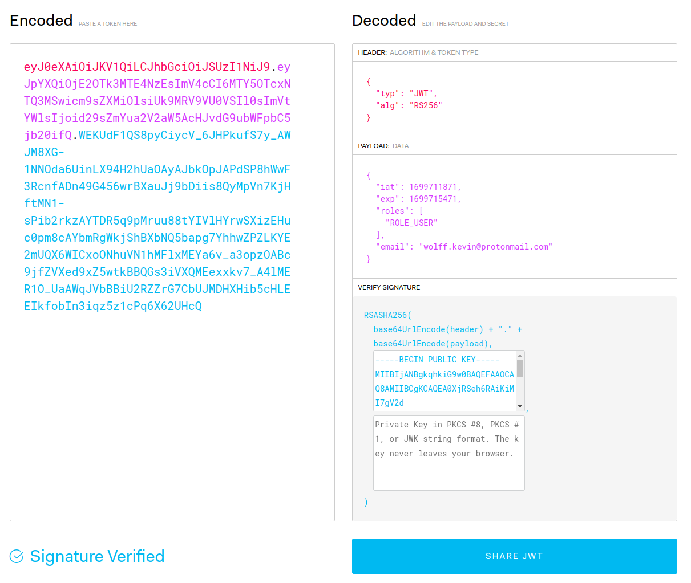
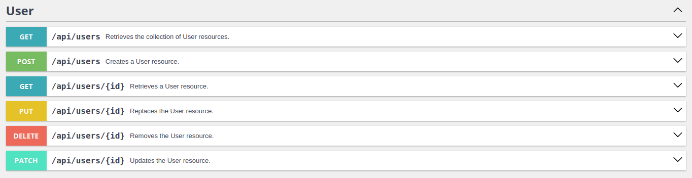
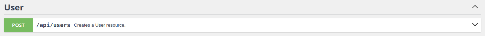
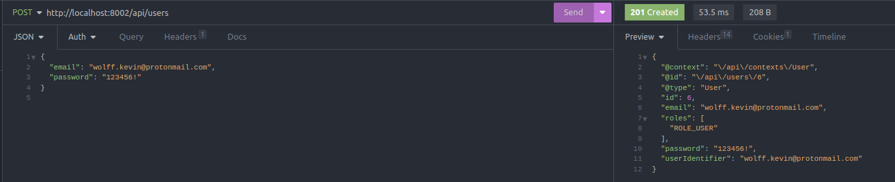
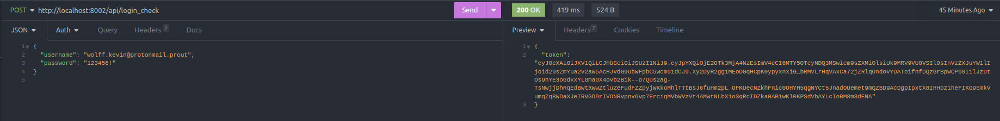
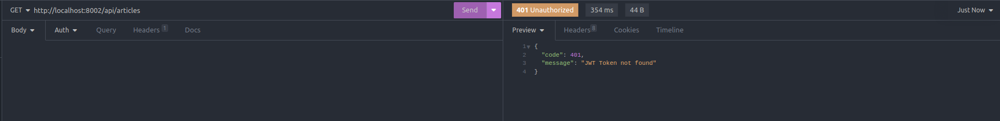

# L’authentification Symfony + API platform + JWT

Version: V0
Type: Technique
Date de création: 11 novembre 2023 14:13
Dernière modification: 14 décembre 2023 15:05

## 👥 Les méthodes d’authentification

On peut identifier deux méthodes d'authentification pour un utilisateur : à travers une session PHP ou en utilisant un JSON Web Token (JWT). 

Les sessions PHP présentent plusieurs inconvénients, notamment leur non-conformité aux principes RESTful, car elles rendent l'API dépendante d'un contexte stocké sur le serveur. En conséquence, la requête du client au serveur n'est pas totalement "autosuffisante", car elle ne contient pas toutes les informations nécessaires à sa compréhension. 

De plus, la nécessité de stocker un état côté serveur soulève une deuxième problématique : elle rend l'authentification difficilement scalable, car la quantité de mémoire requise pour leur stockage croît proportionnellement au nombre d'utilisateurs.

L'utilisation de JSON Web Tokens répond aux limitations des sessions PHP, car elle ne requiert pas le stockage d'un état côté serveur. L'utilisateur peut être authentifié en fournissant son token, qui sera lisible côté client grâce à sa clé publique et pourra être certifié comme valide côté serveur grâce à la clé privée. 

De plus, cette méthode offre la possibilité d'exploiter les tokens même dans des contextes où les cookies sont désactivés, ce qui se révèle particulièrement utile dans le cas d'applications mobiles où la gestion des cookies peut être plus complexe.

## 🪪 RESTful

Le terme "RESTful" provient de l'acronyme "Representational State Transfer" (transfert d'état représentationnel). Il s'agit d'un style d'architecture logicielle qui définit un ensemble de contraintes pour concevoir des services web. L'objectif principal de REST est de favoriser la scalabilité, la simplicité, et la performance des systèmes distribués.

- **Ressources et Identifiants Uniques :** Dans une architecture RESTful, les ressources (comme les données ou les services) sont identifiées par des URI (Uniform Resource Identifiers). Chaque ressource doit avoir une URI unique qui la distingue de manière univoque. Par exemple, une ressource représentant un utilisateur peut être identifiée par l'URI `/utilisateurs/123`.
- **Manipulation des Ressources via des Requêtes HTTP :** Les actions sur les ressources sont effectuées en utilisant les méthodes HTTP standard, telles que GET, POST, PUT, DELETE, etc.
- **Représentation des Ressources :** Les ressources peuvent être représentées sous différentes formes, telles que JSON, XML, HTML, etc. La représentation d'une ressource est généralement incluse dans la réponse du serveur à une requête, permettant au client de comprendre et de manipuler la ressource.
- **État de l'Application :** L'architecture RESTful encourage l'idée que chaque requête du client doit contenir toutes les informations nécessaires pour comprendre et traiter la requête. Cela signifie que le serveur ne stocke pas d'informations sur l'état de la session côté serveur entre les requêtes. Chaque requête est autonome, ce qui simplifie la gestion et l'évolutivité du serveur.

## 🔍 Analyse d’un JWT

Un JSON Web Token (JWT) est un format de jeton d'authentification largement utilisé dans le domaine de l'authentification et de l'autorisation sur le web. Il se compose de trois parties : le "header" (en-tête), le "payload" (charge utile), et la "signature". Chacune de ces parties joue un rôle spécifique dans l'ensemble du processus d'émission et de validation des JWT.

**Header**

- Le header contient des informations sur la manière dont le JWT est encodé, généralement sous la forme d'un objet JSON. Il spécifie le type de jeton (typ) et l'algorithme de hachage utilisé pour générer la signature (alg).

**Payload**

- La payload contient les informations proprement dites que le JWT transporte. Il peut s'agir de détails sur l'utilisateur, des droits d'accès, des informations d'expiration, ou tout autre élément pertinent pour l'application. Exemple :

```json
{
	"sub": "1234567890",
	"name": "Kévin Wolff",
	"role": "[ADMIN]", 
	"email": "kwolff@wagle.com", 
	"exp": 1516239022
}
```

**Signature**

- La signature est générée en prenant le header encodé, la payload encodée, une clé secrète, et en appliquant l'algorithme spécifié dans le header. Cette signature permet de vérifier que le JWT n'a pas été altéré pendant son transport entre le serveur et le client.



## 🕸️ Librairie API Platform

🔗 [API Platform](https://api-platform.com/) pour créer une API Rest

```bash
composer require api
```

Aucune configuration n'est nécessaire pour l'authentification, cependant n'oubliez pas de rendre vos ressources disponibles via l'API. Dans le cadre de cette démonstration, j'ai illustré certains passages avec une entité "Article" rendue disponible via l'API.

- 📄 L’entité `Article.php`
    
    ```php
    <?php
    
    namespace App\Entity;
    
    use ApiPlatform\Metadata\ApiResource;
    use App\Repository\ArticleRepository;
    use Doctrine\ORM\Mapping as ORM;
    
    #[ORM\Entity(repositoryClass: ArticleRepository::class)]
    #[ApiResource]
    class Article
    {
        #[ORM\Id]
        #[ORM\GeneratedValue]
        #[ORM\Column]
        private ?int $id = null;
    
        #[ORM\Column(length: 255)]
        private ?string $title = null;
    
        public function getId(): ?int
        {
            return $this->id;
        }
    
        public function getTitle(): ?string
        {
            return $this->title;
        }
    
        public function setTitle(string $title): static
        {
            $this->title = $title;
    
            return $this;
        }
    }
    ```
    

## 👤 Utilisateur Symfony

Même lorsqu'elle est utilisée via une API, l'authentification Symfony reposant sur le `SecurityBundle` nécessite la configuration du système d'authentification de Symfony ainsi que la création d'une entité "User" qui représente un utilisateur.

Pour créer cette entité et qu’elle soit automatiquement reconnu par le `SecurityBundle` nous utiliserons la commande mise à disposition par le Maker bundle : 

```bash
php bin/console make:user
```

À la suite de cette commande une entité  `src/Entity/User` a été créée avec les propriétés nécessaires ( id, email, roles … ) ainsi que le répertoire associé à l’entité `src/Repository/UserRepository`. Vous êtes libres d'ajouter des champs à votre entité `User`.

N’oubliez pas de créer la migration de base de données et de l’exécuter pour appliquer les changements à la base de données :

```bash
php bin/console make:migration
php bin/console doctrine:migrations:migrate
```

## ✉️ Créer un utilisateur via l’API

Créer un utilisateur revient à générer une entité utilisateur. Pour le moment, cela ne relève pas vraiment du processus d'authentification.

Avant d'authentifier un utilisateur via l'API, commençons par créer un utilisateur. Assurez-vous tout d'abord que votre entité "User" est accessible publiquement en consultant la documentation de votre API à l'adresse [https://localhost:8080/api/docs](https://localhost:8080/api/docs).



Dans un souci de sécurité, nous allons conserver exclusivement la méthode POST pour la création d'utilisateurs. Les autres routes ne seront pas nécessaires pour le moment, et nous renforçons la sécurité en les rendant inaccessibles.

```php
<?php

namespace App\Entity;

...

#[ORM\Entity(repositoryClass: UserRepository::class)]
#[ApiResource(
    operations: [
        new Post()
    ]
)]
class User implements UserInterface, PasswordAuthenticatedUserInterface
...
```



Désormais, vous pouvez créer un utilisateur en utilisant la route /api/users. Pour tester cette fonctionnalité, utilisez un logiciel tel qu'Insomnia pour envoyer vos requêtes sans avoir à développer les composants d'accès aux données de votre frontend.



Il reste une dernière étape : l'encodage du mot de passe. Lorsque l'on utilise le système d'authentification Symfony dans sa version la plus simple et que l'on génère le formulaire d'inscription, un contrôleur est créé et contient le code nécessaire à l'encodage du mot de passe. Il est nécessaire de faire de même lorsqu'un utilisateur crée un compte via l'API. Pour cela, nous utiliserons un contrôleur qui sera appelé lorsqu'une requête avec la méthode POST sera envoyée à la route `/api/users` afin d'exécuter ce traitement.

Créer un controller nommé `SignUpController` :

```bash
php bin/console make:controller
```

Indiquer à la route API d’exploiter le controller :

```php
<?php

namespace App\Entity;

...

#[ORM\Entity(repositoryClass: UserRepository::class)]
#[ApiResource(
    operations: [
        new Post(
            controller: SignUpController::class
        )
    ]
)]
class User implements UserInterface, PasswordAuthenticatedUserInterface
...
```

Rendez-vous dans le contrôleur `SignUpController` et ajoutez le code suivant. Une fois cela en place, vous pourrez créer un utilisateur et constater que son mot de passe est dorénavant encodé.

```php
<?php

namespace App\Controller;

use App\Entity\User;
use Doctrine\ORM\EntityManagerInterface;
use Symfony\Component\HttpFoundation\Response;
use Symfony\Bundle\FrameworkBundle\Controller\AbstractController;
use Symfony\Component\HttpFoundation\Request;
use Symfony\Component\PasswordHasher\Hasher\UserPasswordHasherInterface;

class SignUpController extends AbstractController
{
    private EntityManagerInterface $entityManager;
    private UserPasswordHasherInterface $passwordHasher;

    public function __construct(
        EntityManagerInterface      $entityManager,
        UserPasswordHasherInterface $passwordHasher,
    )
    {
        $this->entityManager = $entityManager;
        $this->passwordHasher = $passwordHasher;
    }

    public function __invoke(Request $request): Response
    {
        // Décode la requête.
        $requestContent = json_decode($request->getContent(), true);

        // Si les clés "email" et "password" ne sont pas présentent dans la requête renvoie une erreur.
        if (!array_key_exists('email', $requestContent) || !array_key_exists('password', $requestContent)) {
            return new Response('Un problème technique est survenu, veuillez réessayer ultérieurement', 500);
        }

        $userEmail = $requestContent['email'];
        $userPassword = $requestContent['password'];

        $userRepository = $this->entityManager->getRepository(User::class);
        $registeredUser = $userRepository->findOneBy(['email' => $userEmail]);

        // Si l'utilisateur est déjà enregistré renvoie une erreur.
        if ($registeredUser) {
            return new Response('Adresse email déjà enregistrée', 409);
        }

        // Hash le mot de passe de l'utilisateur et l'enregistre.
        $newUser = new User();
        $newUser->setEmail($userEmail);
        $newUser->setPassword($this->passwordHasher->hashPassword($newUser, $userPassword));
        $this->entityManager->persist($newUser);
        $this->entityManager->flush();

        return new Response('OK', 200);
    }
}
```

## 🗃️ Librairie JWT Auth

🔗 [LexikJWTAuthenticationBundle](https://symfony.com/bundles/LexikJWTAuthenticationBundle/current/index.html) pour l’authentification par le biais de JWT

```bash
composer require "lexik/jwt-authentication-bundle"
```

ℹ️ Lorsque vous effectuez des configurations sur Symfony, une astuce simple pour déboguer au fur et à mesure est d'exécuter la commande `php bin/console cache:clear`. Cette commande s'exécutera avec succès si la configuration est correcte, ou elle affichera une erreur indicative si la configuration est incorrecte.

- **1. Les clés d’encodage**
    
    Dès lors vous devriez retrouver de nouvelles entrées dans votre fichier `.env` :
    
    ```
    ###> lexik/jwt-authentication-bundle ###
    JWT_SECRET_KEY=%kernel.project_dir%/config/jwt/private.pem
    JWT_PUBLIC_KEY=%kernel.project_dir%/config/jwt/public.pem
    JWT_PASSPHRASE=d27f9338bbff5ee1b196bb4ee066f942172316b3742f90dd7a5974cdf1e50673
    ###< lexik/jwt-authentication-bundle ###
    ```
    
    Après l'installation de la bibliothèque, n'oubliez pas de générer vos clés publiques et privées nécessaires à l'encodage et au décodage de vos tokens :
    
    ```bash
    php bin/console lexik:jwt:generate-keypair
    ```
    
    Ce sont les variables d'environnement nécessaires à l'utilisation de la bibliothèque JWT Auth. Voici leurs rôles :
    
    | JWT_SECRET_KEY | Clé secrète, stockés dans le dossier config/jwt/private.em |
    | --- | --- |
    | JWT_PUBLIC_KEY | Clé publique, stockés dans le dossier config/jwt/public.em |
    | JWT_PASSPHRASE | Utiliser pour générer la clé de chiffrement des clés publiques et privées |
    
- **2. Configuration des firewalls**
    
    Il est nécessaire de modifier la section `firewalls` du fichier de sécurité `security.yaml` responsable du filtrage des requêtes HTTP. Nous allons ajouter deux entrées à la section `firewalls` :
    
    - `login` **:** responsable de l'authentification pour les routes commençant par `/api/login`. Il est configuré comme "stateless" (`stateless: true`), indiquant que les requêtes ne stockent pas d'état côté serveur. Il utilise JWT pour l'authentification.
    - `api` **:** Ce firewall gère les requêtes commençant par **`/**api`. Il est également configuré comme "stateless" et utilise JWT pour l'authentification.
    
    - 📄 Le fichier `security.yaml`
        
        ```yaml
        security:
            # https://symfony.com/doc/current/security.html#registering-the-user-hashing-passwords
            password_hashers:
                Symfony\Component\Security\Core\User\PasswordAuthenticatedUserInterface: 'auto'
            # https://symfony.com/doc/current/security.html#loading-the-user-the-user-provider
            providers:
                # used to reload user from session & other features (e.g. switch_user)
                app_user_provider:
                    entity:
                        class: App\Entity\User
                        property: email
            firewalls:
                login:
                    pattern: ^/api/login
                    stateless: true
                    json_login:
                        check_path: /api/login_check
                        success_handler: lexik_jwt_authentication.handler.authentication_success
                        failure_handler: lexik_jwt_authentication.handler.authentication_failure
                api:
                    pattern: ^/api
                    stateless: true
                    jwt: ~
                dev:
                    pattern: ^/(_(profiler|wdt)|css|images|js)/
                    security: false
                main:
                    lazy: true
            # Easy way to control access for large sections of your site
            # Note: Only the *first* access control that matches will be used
            access_control:
                - { path: ^/api/docs, roles: PUBLIC_ACCESS }
                - { path: ^/api/users, roles: PUBLIC_ACCESS }
                - { path: ^/api,       roles: IS_AUTHENTICATED_FULLY }
        
        when@test:
            security:
                password_hashers:
                    # By default, password hashers are resource intensive and take time. This is
                    # important to generate secure password hashes. In tests however, secure hashes
                    # are not important, waste resources and increase test times. The following
                    # reduces the work factor to the lowest possible values.
                    Symfony\Component\Security\Core\User\PasswordAuthenticatedUserInterface:
                        algorithm: auto
                        cost: 4 # Lowest possible value for bcrypt
                        time_cost: 3 # Lowest possible value for argon
                        memory_cost: 10 # Lowest possible value for argon
        ```
        
    
- **3. Route d’authentification**
    
    Rendez-vous dans le fichier `config/routes.yaml` pour vérifier qu’il contient une entrée pour `api_login_check`.
    
    - 📄 Le fichier `routes.yaml`
        
        ```yaml
        controllers:
            resource:
                path: ../src/Controller/
                namespace: App\Controller
            type: attribute
        api_login_check:
            path: /api/login_check
        ```
        
    
- **4. Configuration pour API Platform**
    
    Rendez-vous dans le fichier `config/packages/lexik_jwt_authentication.yaml` pour vérifier qu’il contient une entrée pour API Platform.
    
    - 📄 Le fichier `lexik_jwt_authentication`
        
        ```yaml
        lexik_jwt_authentication:
            secret_key: '%env(resolve:JWT_SECRET_KEY)%'
            public_key: '%env(resolve:JWT_PUBLIC_KEY)%'
            pass_phrase: '%env(JWT_PASSPHRASE)%'
            api_platform:
                check_path: /api/login_check
                username_path: email
                password_path: security.credentials.password
        ```
        

## 😎 Authentifier un utilisateur via l’API

Grâce aux configurations de JWT la route `/api/login_check` est ouverte aux requêtes POST soumettant un JSON contenant les clés suivantes :

```json
{
	"username": "wolff.kevin@protonmail.prout",
	"password": "123456!"
}
```

Bien que nous utilisions un e-mail comme champ unique pour nos utilisateurs, la valeur de celui-ci doit être envoyée dans une clé "username".

Si votre utilisateur est correctement enregistré en base de données avec un mot de passe encodé, et que votre configuration JWT est correcte, vous devriez recevoir un token lorsque vous soumettez des données d'authentification valides.



Ce token peut être stocké dans le localstorage par exemple, celui-ci sera nécessaire pour s’identifier lorsque l’on fera une requête sur une route protégé.

## ✋ Protéger ses routes et y accéder

Pour cet exemple, j'utiliserai une entité "Article" que je ne souhaite pas rendre accessible publiquement via l'API. Pour ce faire, je spécifie la route API de mon entité dans le fichier `security.yaml`, à la section `access_control`.

```yaml
security:
    ...
    access_control:
        - { path: ^/api/docs, roles: PUBLIC_ACCESS }
        - { path: ^/api/users, roles: PUBLIC_ACCESS }
        - { path: ^/api, roles: IS_AUTHENTICATED_FULLY }
        - { path: ^/api/articles, roles: IS_AUTHENTICATED_FULLY } # ICI
```

Dès lors, la route me renvoie un code 401 lorsque j'envoie une requête, quelle qu'elle soit.



Pour consulter les articles il est alors nécessaire de s’authentifier, pour cela on exploite le token reçus et stocké pour montrer patte blanche. Le token doit se trouver dans le header de votre requête avec pour clé `Authorization` et la valeur débute par `Bearer`, voici un exemple de requête Javascript :

```jsx
const options = {
  method: 'GET',
  headers: {
    'Authorization': 'Bearer <VOTRE_TOKEN>',
    'Content-Type': 'application/json',
  },
};

fetch(url, options)
  .then(response => response.json())
  .then(data => console.log(data))
  .catch(error => console.error('Erreur :', error));
```

L'authentification JWT vérifie votre token, et si celui-ci est valide, vous êtes considéré comme un utilisateur authentifié. Le backend vous fournit alors les données demandées. En cas d'erreur, le serveur renvoie une réponse avec un statut indiquant la nature de l'erreur.