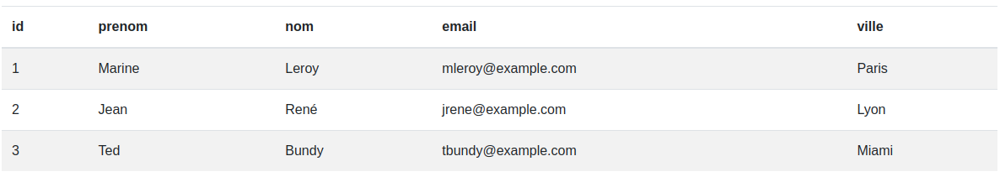
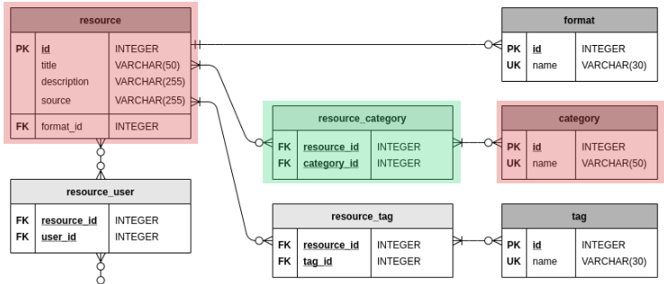

# Documentation MySQL

Version: V0
Type: Technique
Date de création: 23 juillet 2023 23:12
Dernière modification: 14 décembre 2023 16:19

## 👋 Introduction

### Qu’est-ce qu’une base de données ?

**Une base de données est un ensemble d'informations** (données) qui ont été stockées sur un support informatique de manière organisée et structurée afin de pouvoir facilement consulter et modifier leur contenu.

Une base de données est fort utile pour stocker les clients et les informations liées à ces derniers comme les coordonnées et les contacts. Cette même base devra pouvoir stocker des devis, des factures, etc. en lien avec ces clients. Cet ensemble de données constitue une base de données. On peut faire le parallèle avec une boutique e-commerce. La base de données d'un tel site doit pouvoir stocker toutes les informations du catalogue produits ainsi que celles liées aux clients et aux commandes.

Un SGBD est un logiciel permettant d'intéragir avec les informations d'une base de données. On entend par intéragir, sélectionner, ajouter, modifier et supprimer des données de la base. On regroupe généralement ces opérations sous l'acronyme **CRUD**.

ℹ️ **En bref :** 

- Les Systèmes de Gestion de Base de Données (SGBD) permettent de gérer les bases de données.
- MySQL est un SGBD.
- Le langage SQL est utilisé pour dialoguer avec MySQL.

### Organisation d’une bdd

Une base de données MySQL est organisée avec différentes tables. Une base de données contient **une ou plusieurs tables**, dont les noms doivent être uniques au sein de la base de la données. **Une table contient des colonnes**. **Les colonnes contiennent les données**.



## 🗺️ Conception

### Merise

🔗 [Documentation MERISE](https://ineumann.developpez.com/tutoriels/merise/initiation-merise/)

🎥 [Vidéo YouTube à propos de la conception de base de données](https://www.youtube.com/playlist?list=PLB9AbbTDeBzQ5oDCi3NfHivXYrLQyC3Lu) (les 5 premières vidéos sont suffisantes)

> MERISE est une méthode française née dans les années 70, développée initialement par Hubert Tardieu. Elle fut ensuite mise en avant dans les années 80, à la demande du ministère de l'Industrie qui souhaitait une méthode de conception des SI.
> 

### **Modèle conceptuel des données** (MCD)

Il s'agit de l'élaboration du modèle conceptuel des données (MCD) qui est une représentation graphique et structurée des informations mémorisées par un SI. Le MCD est basé sur deux notions principales : les entités et les associations.

L'élaboration du MCD passe par les étapes suivantes :

- l'élaboration du **dictionnaire des données** ;
- la recherche des **dépendances fonctionnelles** entre ces données ;
- l'élaboration du MCD (création des **entités** puis des **associations** puis ajout des **cardinalités**).

### 1️⃣ - Élaboration du dictionnaire des données

---

C'est **une étape intermédiaire qui peut avoir son importance**, surtout si vous êtes plusieurs à travailler sur une même base de données, d'un volume important. Le dictionnaire des données est un **document qui regroupe toutes les données que vous aurez à conserver dans votre base** (et qui figureront donc dans le MCD). Pour chaque donnée, il indique :

- le **code mnémonique :** il s'agit d'un libellé désignant une donnée (par exemple «*titre_l*» pour le titre d'un livre) ;
- la **désignation :** il s'agit d'une mention décrivant ce à quoi la donnée correspond (par exemple «*titre du livre*») ;
- le **type de donnée :**
    
      **🚨 Plutôt que d’utiliser ce qui suit voir chapitre  [Les types de données](https://www.notion.so/MySQL-703c542fe85e467dbd28c5d40d7a711a?pvs=21), plus proche du dessin final de notre base de données**
    
    - **A** ou **Alphabétique :** lorsque la donnée est uniquement composée de caractères alphabétiques (de 'A' à 'Z' et de 'a' à 'z'),
    - **N** ou **Numérique :** lorsque la donnée est composée uniquement de nombres (entiers ou réels),
    - **AN** ou **Alphanumérique :** lorsque la donnée peut être composée à la fois de caractères alphabétiques et numériques,
    - **Date :** lorsque la donnée est une date (au format AAAA-MM-JJ),
    - **Booléen :** Vrai ou Faux ;
- la **taille :** elle s'exprime en nombre de caractères ou de chiffres. Dans le cas d'une date au format AAAA-JJ-MM, on compte également le nombre de caractères, soit 10 caractères. Pour ce qui est du type booléen, nul besoin de préciser la taille (ceci dépend de l'implémentation du SGBDR) ;
- et parfois des **remarques** ou **observations** complémentaires (par exemple si une donnée est strictement supérieure à 0, etc.).

| Code mnémonique | Désignation | Type | Taille | Remarque |
| --- | --- | --- | --- | --- |
| id | Identifiant numérique d'un client | N |  |  |
| nom | Nom d'un client | A | 30 |  |
| prenom | Prénom d'un client | A | 30 |  |
| ville | Ville où habite un client | A | 50 |  |
| email | Email d’un client | AN | 50 |  |
| password | Mot de passe d’un client | AN | 1000 |  |
| command | Nombre de commande(s) d’un client | N | 5 |  |

### 2️⃣ - Dépendances fonctionnelles

---

Les dépendances fonctionnelles qui existent entre les données sont parfois évidentes et ne nécessitent pas toujours une modélisation, mais celle-ci peut s'avérer utile, car elle permet, entre autres, de distinguer les futures entités du MCD et leurs identifiants.

dsl j’ai rien trouvé 😉

### 3️⃣ - Élaboration du MCD

---

🔗 [Draw.io](https://app.diagrams.net/) super outil pour les conceptions de base de données

### 👤 **Les entités**

Chaque entité est unique et est décrite par un ensemble de propriétés. Une des propriétés de l'entité est l'identifiant (id). Cette propriété doit posséder des occurrences uniques et doit être source des dépendances fonctionnelles avec toutes les autres propriétés de l'entité. Bien souvent, on utilise une donnée de type entier qui s'incrémente pour chaque occurrence.

Ainsi, si on reprend notre dictionnaire de données précédent, on schématise par exemple une entité «Client» comme ceci :


### 🔗 **Les relations**

Une association définit un lien sémantique entre une ou plusieurs entités. Généralement le nom de l'association est un verbe définissant le lien entre les entités qui sont reliées par cette dernière. Par exemple :


On définit des règles d’association à l’aide de cardinalités. Les cardinalités sont des caractères (0,1, n) qui fonctionnent par couple et qui sont présents de chaque côté d’une association. C’est grace aux cardinalités que l’on est ensuite capable de créer soit des clés étrangères soit des tables intermédiaires. 

- Les cardinalités minimales sont soit 0 soit 1. Elles servent surtout à déterminer si une occurrence est obligatoirement associée à une autre ou bien si elle est facultative.
- La cardinalités maximale est N, elle indique qu’une occurrence peut être associée à plusieurs autres.

🔍 **Comprendre l’exemple suivant** :

La cardinalité du coté gauche (0,N) indique que le client peut ne pas posséder de commande (**0**,N) ou en posséder plusieurs (0,**N**)

La cardinalité du coté droit (1,1) indique qu’une commande doit appartenir à minimum 1 client (**1**,1) et au maximum à un client (1,**1**)


**🔥 Aller plus loin**

Ajouter les types que vous avez défini dans votre dictionnaire des données


### **Modèle physique des données** (MPD)

L’étape de création du **MPD** est presque **une formalité comparée à la création du MCD**. L’analyste fait évoluer sa modélisation de haut niveau pour la transformer en un schéma plus proche des contraintes des logiciels de bases de données. Il s’agit de préparer l’implémentation dans un SGBDR.

ℹ️ Voir [Les différentes relations](https://www.notion.so/MySQL-703c542fe85e467dbd28c5d40d7a711a?pvs=21)

- Chaque table dispose d’au minimum 1 clé dite primaire.
- Les identifiants se transforment en clés et se retrouvent soulignés.
- Les relations et les cardinalités se transforment en champs parfois soulignés : il s’agit de créer des « clés étrangères » reliées à une « clé primaire » dans une autre table.

🏁 **On passe de ça**


🎉 **À ça**


- Notre propriété `id` est devenue un champ unique grâce à l’annotation `PK` signifiant `primary key`. C’est grâce à ce champ que l’on identifiera les enregistrements dans une table
- Notre relation est devenue un champ dans la table `Order` grâce à l’annotation `FK` pour `foreign key`. C’est grâce à ce champ que l’on pourra retrouver le client d’une commande
- Notre relation est symbolisé par un flèche bien spécial, dans cet exemple elle symbolise :
    - Le client à 0 a N order (voir fin de la flèche collé à l’entité `Order`)
    - La commande à 1 a 1 client (voir fin de la flèche collé à l’entité `Client`)

ℹ️ **Dans la cadre d’une entité qui peut avoir x ou plusieurs lien avec un autre type d’entité**

C’est une relation `many to many`, ici une ressources peut avoir plusieurs catégories et une catégories peut appartenir à plusieurs articles.

Dans le MCD la table intermédiaire (en vert) n’est pas présente, on l’ajoute à notre schema lors du MPD. 

Une relation `many to many` a **forcément** une table intermédiaire reprenant la clé primaire `PK` de chacune des tables



### **Modèle logique des données (MLD)**

Le **MLD** ou Modèle Logique des Données est simplement la représentation textuelle du MPD. Il s’agit de la représentation en ligne du schéma représentant la structure de la base de données.

```sql
client ( id, nom, prenom, ville, email, password )
order ( id, number, amount, date, status )
```

### Les différentes relations

Les cardinalités présentent dans MCD vous indiquent qu’elle type de relation utiliser :

- **One to One (pas besoin de table intermédiaire)** : exemple un maire a une commune, une commune est dirigée par un maire
- **One to Many (pas besoin de table intermédiaire mais la table coté “one” stock la référence)** : exemple une commande à un seul propriétaire, un utilisateur peut avoir plusieurs commandes
- **Many to Many (table intermédiaire)** : exemple une école peut avoir plusieurs étudiants, un étudiants peut avoir plusieurs écoles

### Normes qualitatives de votre BDD :

1. **Précision des données** : elle mesure à quel point les informations stockées dans la base de données reflètent fidèlement la réalité. Les erreurs, les doublons et les incohérences doivent être minimisés.
2. **Complétude** : la complétude évalue si toutes les données nécessaires sont présentes dans la base de données et si elles couvrent tous les aspects du domaine concerné. Des données manquantes peuvent compromettre l'efficacité de l'application ou de l'analyse basée sur la base de données.
3. **Cohérence** : une base de données doit être cohérente, c'est-à-dire que les informations similaires doivent être représentées de manière uniforme. Par exemple, si une même information est stockée à différents endroits, elle doit être identique partout.
4. **Intégrité des données** : l'intégrité des données concerne le respect des contraintes et des règles définies pour garantir la validité des données. Les contraintes d'intégrité (comme les clés primaires, les clés étrangères, etc.) doivent être correctement implémentées et respectées.
5. **Performance** : la performance évalue la rapidité avec laquelle la base de données répond aux requêtes et aux demandes d'accès aux données. Une base de données bien conçue doit être optimisée pour des performances élevées.
6. **Sécurité** : la sécurité des données est primordiale. Cela implique de mettre en place des mécanismes de protection pour éviter les accès non autorisés et prévenir la perte ou la corruption des données.
7. **Évolutivité** : une base de données de qualité doit être capable de s'adapter à l'évolution des besoins en données sans compromettre ses performances et sa fiabilité.


**Par exemple** : dans le cas d’une table “animal” contenant les informations d’un animal ( par exemple pour une animalerie ). On préféra avoir une table “animal” en relation avec une table “race” pour définir la race d’un animal. 

Dans le cas ou l’on stockerais la race sous forme de string dans la table “animal” si une race était amenée à changer de nom il faudrait modifier l’enregistrement de chaque animal utilisant la race à modifier. Cela provoque un problème d’évolutivité et de cohérence.

## 🚀 Commandes SQL

### Tips

ℹ️ Quand vous vous connectez à MySQL **prenez l'habitude de toujours taper les commandes** `SHOW DATABASES;` , `USE ma_base_de_donnee;` ainsi que `SHOW TABLES;`

⚠️ On met toujours un point virgule `;` à la fin d’une commande. Le gros intérêt de ce point-virgule, c'est que l'on peut écrire des instructions SQL sur plusieurs lignes. Tant que SQL ne voit pas le point-virgule il pense que l'instruction n'est pas terminée.

## 📄 Liste des commandes SQL

| Commande | Description |
| --- | --- |
| SHOW DATABASES; | Affiche les bases de données disponibles |
| CREATE DATABASE ma_bdd; | Créer une base de données |
| DROP DATABASE ma_bdd; | Supprimer une base de données |
| USE ma_bdd; | Sélectionne une base de données à utiliser |
| SHOW TABLES; | Affiche les tables disponibles |
| CREATE TABLE ma_table(...); | Créer une table |
| SHOW COLUMNS FROM ma_table; | Affiche les colonnes de la table sélectionnée |
| SELECT * FROM ma_table; | Affiche toutes les données contenus dans la table |
| SELECT ma_colonne_1, ma_colonne_2 FROM ma_table; | Affiche une partie des données contenus dans la table |
| INSERT INTO ma_table ('colonne_1', '...') VALUES ('valeur_colonne_1', '...'); | Insérer des données dans une table |
| UPDATE ma_table SET ma_colonne = nouvelle_valeur WHERE ma_colonne = une_valeur; | Met à jour la/les donnée(s) d’un/de plusieurs enregistrement(s) |

## 🏁 Se connecter à MySQL

```bash
sudo mysql -u root -p
```

ℹ️ `-u root` indique que l’on va utiliser l’utilisateur root pour se connecter. `-p` indique que l’on souhaite se connecter avec un mot de passe. Par default le mot de passe de root est `root`.

## 🌍 Créer sa base de données

> Pre-requis : avoir fait sa conception
> 

I - **Créer la base de données**

```sql
CREATE DATABASE ma_bdd;
```

II - **Utiliser la base de données**

```sql
USE ma_bdd;
```

III - **Créer ses tables**

Votre table doit contenir des colonnes, indiquant leurs noms, types, etc, voir 🔗 [Les types de données](https://www.notion.so/MySQL-703c542fe85e467dbd28c5d40d7a711a?pvs=21)

```sql
CREATE TABLE ma_table(...)
```

IV - **Insérer des données dans vos tables**

Voir 🔗 [CRUD](https://www.notion.so/MySQL-703c542fe85e467dbd28c5d40d7a711a?pvs=21)

V - **********Altérer une table**********

```sql
ALTER TABLE une_table ADD COLUMN nouvelle_colonne VARCHAR(255) NOT NULL; # Ajouter une colonne "nouvelle_colonne" de type VARCHAR NOT NULL à la table "une table"
ALTER TABLE une_table DROP COLUMN une_colonne; # Supprime une colonne
 
```

## 🤖 Exécuter un script SQL dans une base de données

> Pré-requis : avoir un script SQL fonctionnel
Pré-requis : avoir une base de donnée créée, prête à recevoir les données du script
> 

```bash
mysql -u root -p nom_de_la_base_de_donnees < nom_du_fichier.sql
```

## 🧬 **Les types de données**

🔎 **Étudions l’exemple suivant** :

```sql
CREATE TABLE utilisateur (
id INTEGER NOT NULL AUTO_INCREMENT PRIMARY KEY,
nom VARCHAR(100),
prenom VARCHAR(100),
email VARCHAR(255) NOT NULL UNIQUE
); 
```

Chacune de nos entités va avoir des propriétés, par exemple mon entité `Utilisateur` va avoir une propriété `nom` qui contiendra une string, en SQL on utilisera le type `VARCHAR`.

⚠️ le champ id est un champ important pour le fonctionnement de la base de données.

| Nom du champ | Type du champ et options | Description |
| --- | --- | --- |
| id | PRIMARY KEY (option) | ⚠️ Champ spécial obligatoire dans toutes les tables. Indique à MySQL que ce champ sera l'identifiant permettant d'identifier les objets. |
|  | INTEGER (type) | ⚠️ Champ numérique sous forme de nombre entier. |
|  | NOT NULL (option) | ⚠️ Ce champ ne peut pas être nul. |
|  | AUTO_INCREMENT (option) |  ⚠️ Ce champ sera créé par MySQL automatiquement, pas besoin de s'en soucier ! MySQL va utiliser l'id précédent et y ajouter +1 lors de l'ajout d'un nouvel objet. |
| nom | VARCHAR(100) (type) | Champ sous forme de texte, limité à 100 caractères. |
| prenom | VARCHAR(100) (type) | Champ sous forme de texte, limité à 100 caractères. |
| email | VARCHAR(255) (type) | Champ sous forme de texte, limité à 255 caractères. |
|  | NOT NULL (option) | Ce champ ne peut pas être nul. |
|  | UNIQUE (option) | Ce champ ne peut pas avoir la même valeur en double. |

🔍 **Nouvelle exemple** :

```sql
CREATE TABLE aliment (
id INTEGER NOT NULL AUTO_INCREMENT PRIMARY KEY,
nom VARCHAR(100) NOT NULL,
marque VARCHAR(100),
sucre FLOAT,
calories INTEGER NOT NULL,
bio BOOLEAN DEFAULT false,
peremption DATE
);
```

| Nom du champ | Type du champ et options | Description |
| --- | --- | --- |
| id | PRIMARY KEY (option) | ⚠️ Champ spécial obligatoire dans toutes les tables. Indique à MySQL que ce champ sera l'identifiant permettant d'identifier les objets. |
|  | INTEGER (type) | ⚠️ Champ numérique sous forme de nombre entier. |
|  | NOT NULL (option) | ⚠️ Ce champ ne peut pas être nul. |
|  | AUTO_INCREMENT (option) | ⚠️ Ce champ sera créé par MySQL automatiquement, pas besoin de s'en soucier ! MySQL va utiliser l'id précédent et y ajouter +1 lors de l'ajout d'un nouvel objet. |
| nom | VARCHAR(100) (type) | Champ sous forme de texte, limité à 100 caractères. |
| marque | VARCHAR(100) (type) | Champ sous forme de texte, limité à 100 caractères. |
| sucre | FLOAT (type) | Champ chiffres décimaux |
| calories | INTEGER (type) | Champ numérique sous forme de nombre entier. |
|  | NOT NULL (option) | Ce champ ne peut pas être nul. |
| bio | BOOLEAN (type) | Champ true / false |
|  | DEFAULT (type) | Valeur par défaut du type, ici BOOLEAN donc true ou false |
| peremption | DATE | Champ sous forme de date '0000-00-00’ |

## 💻 CRUD

**C**reate - **R**ead - **U**pdate - **D**elete

**Dans la présentation suivante nous utiliserons une table comme celle-ci** :


### 🔎 Read

```sql
SELECT email FROM utilisateur; # Selectionne les email de la table utilisateur
SELECT nom, prenom FROM utilisateur; # Selectionne les noms et prenoms de la table utilisateur
SELECT * FROM utilisateur; # Selectionne tous les enregistrements de la table utilisateur
```

**Exemple générique**

```sql
SELECT une_colonne FROM une_table; # Pour selectionner une colonne
SELECT une_colonne, une_seconde_colonne FROM une_table; # Pour selectionner plusieurs colonne
SELECT * FROM une_table; # Pour selectionner toutes les colonnes
```

**ℹ️ On peut affiner nos recherches, les conditionner, agréger nos données, etc** 

### AS - alias

En SQL, il est possible d'utiliser des alias. Il s'agit de **renommer temporairement une colonne ou une table dans une requête**. Cette fonctionnalité est très pratique pour faciliter la lecture des résultats d'une reqûete SQL. Au niveau des tables, **l'intérêt d'utiliser des alias se vérifie lorsqu'il y a des jointures**. Cela permet notamment d'obtenir des noms plus courts pour les tables.

```sql
SELECT une_colonne AS ce_que_vous_voulez FROM une_table; # Utiliser un alias sur une colonne
SELECT * FROM une_table AS ce_que_vous_voulez; # Utiliser un alias sur une table
```

### LIMIT et OFFSET - limite de résultat

En SQL, la commande `LIMIT` permet de **spécifier le nombre maximum de résultats** que l’on souhaite obtenir, tandis que la commande `OFFSET` permet d'**effectuer un décalage sur l'ensemble des résultats**.

```sql
SELECT * FROM une_table LIMIT une_limite; # Définir un nombre maximum de résultats
SELECT une_colonne FROM une_table OFFSET un_offset; # Définir un décalage dans les résultats
```

### Fonctions d’agrégation

En SQL, les fonctions d’agrégation permettent de **réaliser des opérations arithmétiques et statistiques** au sein d'une requête.

- `COUNT()` pour compter le nombre d’enregistrements d'une table ou d'une colonne distincte ;
- `AVG()` pour calculer la moyenne sur un ensemble d’enregistrements ;
- `SUM()` pour calculer la somme sur un ensemble d’enregistrements ;
- `MAX()` pour récupérer la valeur maximum d’une colonne sur un ensemble d’enregistrements ;
- `MIN()` pour récupérer la valeur minimum de la même manière que la fonction `MAX()`.

Utiliser une fonction.

```sql
SELECT votre_fonction(une_colonne) FROM une_table;
```

**COUNT**

En SQL, la fonction d’agrégation `COUNT()` permet de **compter le nombre d’enregistrements** dans une table, les enregistrements qui possèdent la valeur **NULL ne seront pas comptabilisés**.

```sql
SELECT COUNT(une_colonne) FROM une_table;
```

**AVG**

En SQL, la fonction d’agrégation `AVG()` permet de **calculer une valeur moyenne sur un ensemble d’enregistrements** de type numérique et **qui ne possèdent pas la valeur NULL**.

```sql
SELECT AVG(une_colonne) FROM une_table;
```

**SUM**

En SQL, la fonction d’agrégation `SUM()` permet de **calculer la somme sur un ensemble d’enregistrements** de type numérique et **qui ne possèdent pas la valeur NULL**.

```sql
SELECT SUM(une_colonne) FROM une_table;
```

**MIN et MAX**

En SQL, les fonctions d’agrégation `MAX()` et `MIN()` permettent de **sélectionner la valeur respectivement maximale et minimale dans un ensemble d’enregistrements**. **Les valeurs NULL sont écartées**.

```sql
SELECT MAX(une_colonne) FROM une_table;
SELECT MIN(une_colonne) FROM une_table;
```

### WHERE - condition

En SQL, la commande `WHERE` permet d’extraire les lignes d’une table dans une base de données, qui respectent une condition. Cela permet de filtrer les données désirées.

```sql
SELECT une_colonne FROM une_table WHERE une_condition;
```

Cette requête SQL va donc sélectionner grâce à la commande `SELECT`, la colonne *une_colonne* provenant de la table nommée *une_table* qui respecte la condition *une_condition* de la commande `WHERE`.

**Opérateurs de conditions**

| Opérateur | Description |
| --- | --- |
| = | Égal |
| != ou <> | Différent |
| > | Strictement supérieur |
| >= | Supérieur ou égal |
| < | Strictement inférieur |
| <= | Inférieur ou égal |
| IS NULL | Valeur est égale à NULL |
| IS NOT NULL | Valeur n'est pas égale à NULL |

**Exemple concret** :

```sql
SELECT * FROM clients WHERE ville = 'Grenoble'; # Selectionne tous les clients qui habitent à Grenoble
SELECT * FROM clients WHERE ville != 'Grenoble'; # Selectionne tous les clients qui n'habitent pas à Grenoble
SELECT * FROM clients WHERE command > 3; # Selectionne tous les clients qui ont plus de 3 commandes
SELECT * FROM clients WHERE command >= 3; # Selectionne tous les clients qui ont 3 commandes ou plus
SELECT * FROM clients WHERE command < 3; # Selectionne tous les clients qui ont moins de 3 commandes
SELECT * FROM clients WHERE command <= 3; # Selectionne tous les clients qui ont 3 commandes ou moins
SELECT * FROM clients WHERE email IS NULL; # Selectionne tous les clients qui ont une adresse mail NULL
SELECT * FROM clients WHERE email IS NOT NULL; # Selectionne tous les clients qui n'ont pas une adresse mail NULL
```

### BETWEEN - condition

En SQL, l'opérateur `BETWEEN` permet de sélectionner des enregistrements en fonction d'une intervalle. Cet opérateur s'utilise avec la commande `WHERE`. L'intervalle peut être constitué de chaînes de caractères, de nombres ou de dates.

```sql
SELECT une_colonne FROM une_table WHERE une_colonne BETWEEN "valeur_1" AND "valeur_2";
```

**Exemple concret** :

```sql
SELECT * FROM clients WHERE command BETWEEN 0 AND 3; # Selectionne toutes les infos clients des clients si ils ont entre 0 et 3 commandes
SELECT nom, commande FROM clients WHERE nom BETWEEN "Kévin" AND "Arthur"; # Selectionne le nom et le nombre de commande d'un client si ils ont un nom égale à Kévin ou Arthur
```

### LIKE - condition

En SQL, l'opérateur `LIKE` permet de faire une recherche suivant un modèle sur les valeurs d'une colonne. Il existe plusieurs modèles de recherches (pattern en anglais) que nous détaillerons par la suite. Une nouvelle fois, cet opérateur s'utilise avec la commande `WHERE`. C'est un opérateur extrêmement puissant qui offre de nombreuses possibilités.

```sql
SELECT une_colonne FROM une_table WHERE une_colonne LIKE un_modele;
```

🃏 **Caractères joker** :

L'opérateur `LIKE` est inséparable des caractères jokers (wildcards) : `%` (pourcentage) et `_` (underscore). **Un caractère joker est utilisé pour se substituer à n'importe quel autre caractère**, au sein d'une chaîne de caractères :

Joker `%` : il représente aucun, un seul ou plusieurs caractères.
Joker `_` : il représente un seul et unique caractère.

| Modèle | Commentaire |
| --- | --- |
| LIKE "a%" | Recherche toutes les chaînes de caractères qui commencent par le caractère a. |
| LIKE "%a" | Recherche toutes les chaînes de caractères qui terminent par le caractère a. |
| LIKE "%a%" | Recherche toutes les chaînes de caractères qui contiennent au moins un caractère a. |
| LIKE "a%b" | Recherche toutes les chaînes de caractères qui commencent par le caractère a et terminent par le caractère b. |
| LIKE "a__" | Recherche toutes les chaînes de caractères de trois caractères qui commencent par le caractère a. |
| LIKE "_a%" | Recherche toutes les chaînes de caractères qui possèdent le caractère a en deuxième position. |

**Exemple concret** :

```sql
SELECT * FROM clients WHERE email LIKE "%@yeah.com"; # Sélectionne tous les clients avec un email terminant par `@yeah.com`
SELECT * FROM clients WHERE email LIKE "contact@%.com"; # Sélectionne tous les clients avec un email commençant par `contact@` et terminant par `.com`
```

### AND et OR - additionner les conditions

Les opérateurs logiques `AND` et `OR` peuvent être utilisés en complément de la commande `WHERE` pour combiner des conditions.

```sql
SELECT une_colonne FROM une_table WHERE une_condition AND une_autre_condition;
SELECT une_colonne FROM une_table WHERE une_condition OR encore_condition;
```

**Exemple concret** :

```sql
SELECT * FROM clients WHERE ville = 'Grenoble' AND command > 3;
SELECT nom, prenom FROM clients WHERE command > 2 OR email IS NOT NULL;
```

### ORDER BY - trier

En SQL, la commande `ORDER BY` permet de trier les résultats d'une requête. Il est possible de trier les données sur une ou plusieurs colonnes, par ordre ascendant (`ASC`) ou descendant (`DESC`).

```sql
SELECT une_colonne FROM une_table ORDER BY une_colonne_2;
```

**Exemple concret** :

```sql
SELECT * FROM client ORDER BY name ASC; # Selectionne toutes les infos clients, trié par le prénom dans l'ordre ascendant
SELECT nom, prenom FROM client ORDER BY id DESC; # Selectionne les noms + prénoms des clients, trié par le id dans l'ordre descendant
```

Pour **trier sur plusieurs colonnes**, il faut donc les séparer avec des `,` (virgules).

```sql
SELECT * FROM client ORDER BY name ASC, id DESC; # Selectionne toutes les infos clients, trié par le prénom dans un ordre ascendant puis le id dans un ordre descendant
```

### Jointures - fusionner plusieurs tables pour une requête

Depuis le début nos requêtes portent uniquement sur une table à la fois. **Les jointures en SQL permettent d’associer plusieurs tables dans une même requête**. Cela permet d'**exploiter la puissance des bases de données relationnelles pour obtenir des résultats qui combinent les données de plusieurs tables en même temps** de manière efficace. Dans ce chapitre, nous aborderons deux types de jointures différents avec les commandes SQL suivantes : `INNER JOIN` et `LEFT JOIN`.

**Les jointures SQL consistent à associer les lignes de deux tables en associant l'égalité des valeurs d'une colonne d'une première table par rapport à la valeur d'une colonne d'une seconde table**. On nomme ce concept : la condition. L'intérêt des jointures ? Elles sont tout d'abord un moyen d'optimiser les processus, en améliorant leur vitesse d'exécution. De manière générale, il est préférable de faire une seule requête avec plusieurs jointures plutôt que plusieurs requêtes simples. Elles permettent également d'éviter les répétitions d'informations.

### `INNER JOINT`

Dans le langage SQL la commande `INNER JOIN`, est un type de **jointure très commune pour lier plusieurs tables entre-elles** dans une même requête. Cette commande **retourne les enregistrements lorsqu'il y a au moins une ligne dans chaque colonne listé dans la condition**. Autrement dit, lorsque la condition est respectée dans les deux tables.

```sql
SELECT * FROM table_1 INNER JOIN table_2 ON table_1.une_colonne = table_2.autre_colonne;
```

Cette requête SQL va donc sélectionner grâce à la commande `INNER JOIN` les enregistrements des tables `table_1` et `table_2` lorsque les données de la colonne `une_colonne` de la table `table_1` est égal aux données de la colonne `autre_colonne` de la table `table_2`.

**Exemple concret** :

```sql
SELECT * FROM client INNER JOIN commandes ON client.commande_id = commande.id; # Selectionne tous les clients avec une `commande_id` correspondant au id d'une commande
SELECT * FROM mere INNER JOIN enfant ON mere.enfant_id = enfant_id;
```

### `LEFT JOIN`

Dans le langage SQL la commande `LEFT JOIN`, est un type de jointure commune pour lier plusieurs tables entre-elles dans une même requête. **Cette commande retourne tous les enregistrements de la table première table, celle de gauche (left), avec la correspondance dans la deuxième table si la condition est respectée**. En d'autres termes, ce type de jointure permet de retourner tous les enregistrements d'une table avec les données liées d'une autre table si elles existent

```sql
SELECT * FROM table_1 LEFT JOIN table_2 ON table_1.une_colonne = table_2.autre_colonne;
```

Cette requête SQL va donc sélectionner grâce à la commande `LEFT JOIN` tous les enregistrements de la table `table_1` lorsque les données de la colonne `une_colonne` de la table `table_1` est égal aux données de la colonne `autre_colonne` de la table `table_2`.

**Exemple concret** :

```sql
SELECT * FROM client LEFT JOIN commandes ON client.commande_id = commande.id;
SELECT * FROM mere LEFT JOIN enfant ON mere.enfant_id = enfant_id;
```

### ➕ Create

```sql
INSERT INTO `utilisateur` (`nom`, `prenom`, `email`)
VALUES ('Durantay', 'Quentin', 'quentin@gmail.com');
```

ℹ️ Remarquez que je ne me préoccupe pas de l’id. Je pourrais tout à fait le renseigner. Mais souvenez-vous, nous l’avons configuré de manière à ce que MySQL l’auto-incrémente pour nous.

**Exemple générique**, vous pouvez avoir X colonne et donc X valeurs à passer.

```sql
INSERT INTO ma_table (`colonne_1`, `colonne_2`, `...`)
VALUES ('valeur_colonne_1', 'valeur_colonne_2', '...');
```

Il est possible d’ajouter plusieurs objets en une seule commande en séparant leurs valeurs par des virgules

```sql
INSERT INTO `utilisateur` (`nom`, `prenom`, `email`)
VALUES
('Doe', 'John', 'john@yahoo.fr'),
('Smith', 'Jane', 'jane@hotmail.com'),
('Dupont', 'Sebastien', 'sebastien@orange.fr'),
('Martin', 'Emilie', 'emilie@gmail.com');
```

### 🔄 Update

```sql
UPDATE `utilisateur` SET `email` = 'quentind@gmail.com' WHERE `id` = '1'; # Change l'email de l'utilisateur avec l'id 1
UPDATE `utilisateur` SET `nom` = 'dumet' WHERE `id` = '3'; # Change le nom de l'utilisateur avec l'id 3
UPDATE `utilisateur` SET `prenom` = 'kevin' WHERE `email` = 'sf@gmail.com'; # Change le prénom de/des utilisateur(s) avec l'email sf@gmail.com
```

| Mot clé | Description |
| --- | --- |
| UPDATE table | Signifie à SQL que vous souhaitez mettre à jour de la donnée dans votre BDD. Vous indiquez aussi la table dans laquelle se trouve(nt) le ou les objets que vous souhaitez modifier. |
| SET une_colonne = une_valeur | Sert à indiquer à SQL quelles sont la ou les colonnes à modifier, et quelles sont la ou les valeurs qu’elles doivent désormais prendre. |
| WHERE une_colonne = une_valeur | C’est ce qu’on appelle un filtre. Vous allez les voir plus en détail dans la partie 3, mais sachez qu’ils servent à restreindre la commande en cours à un ou des objets répondant à des conditions précises. Ici, on va mettre à jour uniquement l’objet dont l’id est 1, soit le premier utilisateur ! |

**Exemple générique**

```sql
UPDATE une_table SET une_colonne = une_valeur WHERE une_colonne = une_valeur;
```

**🚨 Commande à utiliser avec pré-caution ! ne pas reproduire ce qui suit**

```sql
UPDATE `utilisateur` SET `prenom` = "quentin";
```

Vous n’avez pas utiliser `WHERE` pour filtrer les entités à modifier, tous vos utilisateurs s’appelle Quentin …

### 🗑️ Delete

```sql
DELETE FROM `utilisateur` WHERE `id` = '2'; # Supprime l'utilisateur avec l'id 2
DELETE FROM `utilisateur` WHERE `prenom` = 'Quentin'; # Supprime le/les utilisateur(s) avec le prénom Quentin
DELETE FROM `utilisateur`; # Supprime tous les enregistrements
```

**🚨 ZONE DANGER**

Réfléchissez à deux fois avant d’utiliser les commandes suivantes !

```sql
DROP TABLE `utilisateur`; # Supprime une table
DROP DATABASE `test`; # Supprime une base de données
```

## 📣 Les transactions

Elles sont nécessaires à l’élaboration d’un script MySQL.

```sql
START TRANSACTION; # Débute la transaction
COMMIT # Valide et persiste les requêtes exécutées, utiliser à la fin d'une transaction
```

## 🔐 Les clés étrangères et primaires

**Clé étrangère**

Lorsque deux entités ont une relation on doit la définir à l’aide d’une clé étrangère. Dans l’exemple suivant on créer une relation entre un `course` est un `teacher`

```sql
CREATE TABLE IF NOT EXISTS `teacher` (
    `id` int(10) NOT NULL AUTO_INCREMENT,
    `first_name` varchar(80) NOT NULL,
    `second_name` varchar(80) NOT NULL,
    `speciality` varchar(80),
    `available` boolean NOT NULL,
    PRIMARY KEY (`id`),
);

CREATE TABLE IF NOT EXISTS `course` (
    `id` int(10) NOT NULL AUTO_INCREMENT,
    `subject` varchar(60) NOT NULL,
    `teacher_id` int(10),
    `available` boolean NOT NULL,
    PRIMARY KEY (`id`),
    CONSTRAINT fk_course_teacher # Ma contrainte va s'apeller fk_course_teacher
    FOREIGN KEY (teacher_id) # Elle alimente la colonne teacher_id 
    REFERENCES teacher(id) # Indique la table de référence et sa colonne 
);
```

| Mot clé | Description |
| --- | --- |
| CONSTRAINT | Donner un nom à votre contrainte, respecter la nomenclature suivante : fk_<la_table_avec_la_fk>_<la_table_cible> |
| FOREIGN KEY | Indique la colonne dans laquelle stocker la valeur de la relation |
| REFERENCES | La table et la colonne à laquelle vous faite référence dans votre relation |

**Clé primaire**

Tout entité doit avoir un champ primaire, nécessaire à son identification unique au sein de sa table

```sql
CREATE TABLE user (
    id INT NOT NULL AUTO_INCREMENT,
    email VARCHAR(100) NOT NULL,
    PRIMARY KEY (id) # Utilise la colonne id comme clé primaire
);
```