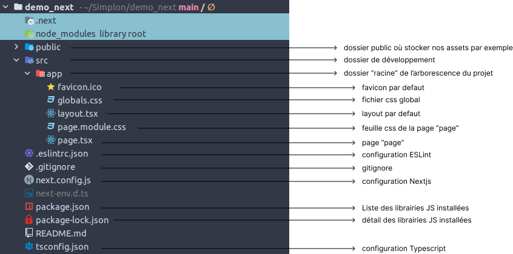
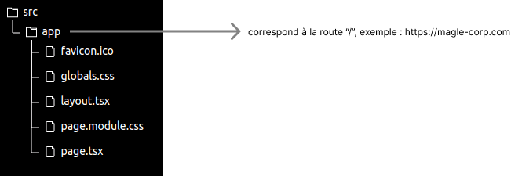
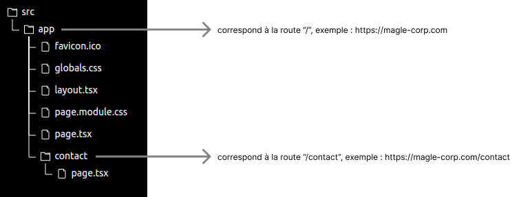
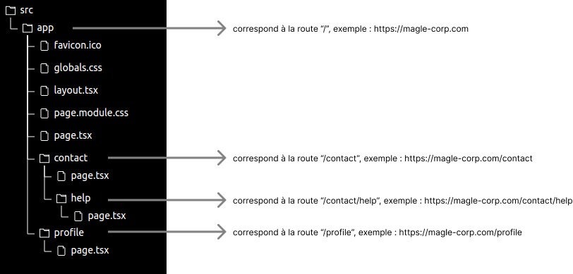
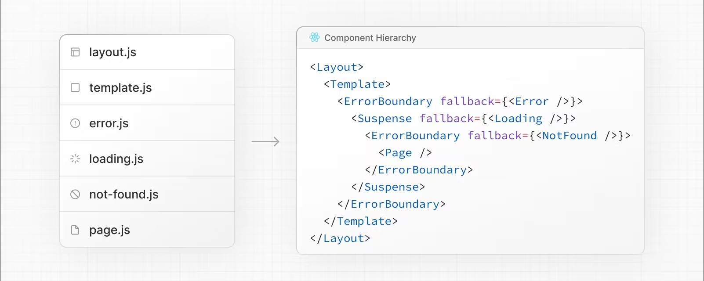
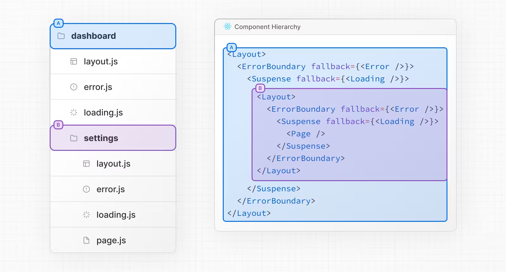

# Next

Version: V1
Type: Technique
Date de création: 14 décembre 2023 16:00
Dernière modification: 14 décembre 2023 16:02

🔗 [Tutoriel React](https://react.dev/learn/tutorial-tic-tac-toe)

🔗 [Penser React](https://react.dev/learn/thinking-in-react)

## 🏗️ Installation

🔗 [Documentation officielle chapitre “installation” de React](https://react.dev/learn/start-a-new-react-project)

🔗 [Documentation officielle chapitre “installation” de Nextjs](https://nextjs.org/docs/getting-started/installation)

Next.js est un framework pour React destiné à créer des applications Web. Il s’appuie sur React pour créer des interfaces utilisateur à l'aide de composants et il fournit aussi une structure, des fonctionnalités et des optimisations supplémentaires pour votre application.

La documentation officielle de React nous invite à utiliser React au travers un framework comme Nextjs, Remix, Gatsby … En effet React est une librairie, contrairement à un framework celui-ci ne fournit pas une palette d’outils destinés à nous faciliter la tâche, c’est la où intervient Nextjs.

- Liste des fonctionnalités mises à disposition par Nextjs
    
    
    | Routing | Un routeur basé sur un système de fichiers construit sur des composants serveur qui prend en charge les dispositions, le routage imbriqué, les états de chargement, la gestion des erreurs, etc. |
    | --- | --- |
    | Rendering | Rendu côté client et côté serveur avec des composants client et serveur. Optimisé davantage avec le rendu statique et dynamique sur le serveur avec Next.js. Streaming sur les environnements d'exécution Edge et Node.js. |
    | Data Fetching | Récupération de données simplifiée avec prise en charge asynchrone/attente dans les composants React et l'API fetch()s qui s'aligne sur React et la plate-forme Web. |
    | Styling | Prise en charge de vos méthodes de style préférées, y compris les modules CSS, Tailwind CSS et CSS-in-JS |
    | Optimizations | Optimisations des images, des polices et des scripts pour améliorer les éléments vitaux Web de base et l'expérience utilisateur de votre application. |
    | Typescript | Prise en charge améliorée de TypeScript, avec une meilleure vérification de type et une compilation plus efficace, ainsi qu'un plug-in TypeScript personnalisé et un vérificateur de type. |
    | API Reference | Mises à jour de la conception de l'API dans Next.js. Veuillez vous référer à la section de référence de l'API pour les nouvelles API. |

- **1. Installation**
    
    Créer un projet Nextjs
    
    ```bash
    npx create-next-app@latest
    ```
    
    Prompt à la création :
    
    ```bash
    What is your project named?                                           -> nom de votre projet
    Would you like to use TypeScript with this project? No / Yes          -> à vous de voir
    Would you like to use ESLint with this project? No / Yes              -> à vous de voir
    Would you like to use Tailwind CSS with this project? No / Yes        -> à vous de voir
    Would you like to use `src/` directory with this project? No / Yes    -> oui
    Use App Router (recommended)? No / Yes                                -> oui
    Would you like to customize the default import alias? No / Yes        -> à vous de voir
    ```
    
- **2. Démarrer l’application**
    
    Exécuter le serveur
    
    ```bash
    npm run dev // rendez-vous sur http://localhost:3000
    ```
    
- **3. Architecture du projet initialisé**
    
    
    
    
    **💡À savoir :**
    
    Depuis la version 13 de Nextjs, l’arborescence du projet ( sous-entendu l’arborescence des pages de notre site web ) va être défini par l’organisation de nos dossiers et fichiers au sein du dossier `src/app`.
    
    ⚠️ Si vous avez choisi d’utiliser Typescript vos fichier React ( les fichiers contenant un/des composant(s) React ) devront utiliser l’extension `.tsx`, si vous utilisez Javascript alors l’extension est `.jsx`.
    
- **4. Styles**
    
    🔗 [Documentation officielle chapitre “style”](https://nextjs.org/docs/app/building-your-application/styling)
    
    Next.js prend en charge les modules CSS utilisant l'extension .module.css, exemple : `header.module.css`, `footer.module.css`.
    
    Les modules CSS créer automatiquement un nom de classe unique. Cela vous permet d'utiliser le même nom de classe dans différents fichiers sans vous soucier des collisions. Ce comportement fait des modules CSS le moyen idéal d'inclure du CSS au niveau des composants.
    
    ℹ️ Dans le JSX l’attribut HTML `class` est remplacé par `className`, exemple : `<div className="ma-class-css">...</div>`.
    
    ℹ️ Les modules CSS sont une fonctionnalité facultative et ne sont activés que pour les fichiers avec l'extension `.module.css`.
    
    - Exemple avec la création d’un header :
        
        
        1. Créer une feuille de style spécifique au composant `Header.tsx`.
        2. Importer la feuille CSS dans le composant `Header.tsx`.
        3. Attribuer la classes souhaité à l’élément souhaité, ici je donne la classe `header` à la div englobant tout le header
        
        - 💻 Exemple d’un composant `Header.tsx`
            
            ```jsx
            import styles from './header.module.css'
             
            export default function Header() {
              return (
            		<div className={styles.header}>
            			<h1>Maglecorp</h1>
            			<nav>
            				<ul>
            					<li>
            						<a href='#'>Lien 1</a>
            					</li>
            					<li>
            						<a href='#'>Lien 2</a>
            					</li>
            				</ul>
            			</nav>
            		</div>
            	)
            }
            ```
            
        - 💻 Exemple d’une feuille de style `header.module.css`
            
            ```jsx
            .header {
              padding: 24px;
            }
            
            .header > h1 {
            	color: red;
            }
            
            .header > nav > ul {
            	list-style-type: none;
            }
            ```
            
        
    - Utiliser SASS / SCSS :
        
        Installer la librairie SASS.
        
        ```bash
        npm install --save-dev sass
        ```
        
        Ajouter la configuration indiquées dans la document Next dans le fichier `next.config.js`.
        
        ```jsx
        const path = require('path')
        
        /** @type {import('next').NextConfig} */
        const nextConfig = {
            sassOptions: {
                includePaths: [path.join(__dirname, 'styles')],
            },
        }
        
        module.exports = nextConfig
        ```
        

## 🛣️ Page et routing

🔗 [Documentation officielle chapitre “fondamentaux du routing”](https://nextjs.org/docs/app/building-your-application/routing)

🔗 [Documentation officielle chapitre “routing”](https://nextjs.org/docs/app/building-your-application/routing/defining-routes)

🔗 [Documentation officielle chapitre “routing dynamique”](https://nextjs.org/docs/app/building-your-application/routing/dynamic-routes)

- **1. Système de routing**
    
    Next.js utilise un routeur basé sur un système de fichiers où les dossiers sont utilisés pour définir les itinéraires.
    
    ℹ️ Chaque dossier représente un segment de route qui correspond à un segment d'URL. Pour créer une route imbriquée, vous pouvez imbriquer des dossiers les uns dans les autres.
    
    
    
    Ici le dossier `src` est celui initialisé par la commande de création d’un projet Next. Par défaut celui-ci contient un dossier `app`, ce dossier correspond à la racine du routing de notre application.
    
    Au sein de ce dossier l’on retrouve différents fichiers qui seront abordés plus tard, pour l’instant nous nous concentrerons sur le fichier `page.tsx`. Ce sont les fichiers ( un par dossier ) `page.tsx` qui permettent de rendre des pages de notre application accessible publiquement.
    
    
    
    Ici nous avons ajouté un dossier `contact` au sein du dossier `app`, ce nouveau dossier contient un fichier `page.tsx`, par conséquent la route `/contact` est bien accessible. Si jamais le dossier avait été créé mais ne contenait pas le fichier `page.tsx` alors la route `/contact` retournerait une erreur 404.
    
    
    
    Ici nous avons ajouté un dossier `help` ( et son fichier `page.tsx` ) au sein du dossier `contact` pour rendre disponible la route `/contact/help`.
    
- **2. Routing dynamique**
    
    Le routeur basé sur un système de fichiers de Next permet de définir des routes dynamiques en mettant entre crochet le nom du dossier.
    
    Il est possible d’imbriquer une route dynamique dans une autre.
    
    | Route | Example URL | params |
    | --- | --- | --- |
    | app/blog/[slug]/page.js | /blog/aventure | { slug: 'aventure' } |
    | app/shop/[product]/page.js | /shop/coca-cola | { product: 'coca-cola' } |
    | app/results/[team]/page.js | /results/om | { team: 'om' } |
    | app/results/[sport]/[team]/page.js | /results/football/om | { sport: 'football', team: 'om' } |
    
    Avec l’architecture de dossiers suivante : `app/shop/[product]/page.js` l’utilisateur peut se rendre sur la page `https://magle-corp/shop/coca-cola`.
    
    Dans le composant React `app/shop/[product]/page.js` il va alors être possible de récupérer le paramètre dynamique de l’URL, ici  `[product]`.
    
    Pour cela il faut exploiter les paramètres reçut par notre composant ( ces paramètres sont mis à disposition par Next, il faut juste les appeler).
    
    ```bash
    export default function ProductDetail({ params }) {
        console.log(params) // retourne { product: 'coca-cola' }
        
        return (
            <p>Page détail d'un produit</p>
        )
    }
    ```
    
- **3. Structure et convention**
    
    🔗 [Documentation officielle chapitre “structure d’un projet”](https://nextjs.org/docs/getting-started/project-structure)
    
    Si vous créez un fichier avec l’un des noms ci-dessous au sein d’un dossier de routing celui-ci sera reconnu par Next et bénéficiera d’un comportement spécifique, exemple :
    
    les fichiers `page.tsx` sont reconnus comme étant la page public à afficher d’un dossier.
    
    ⚠️ le fichier `layout.tsx` du dossier `app` ne doit pas être supprimé.
    
    | layout | Interface utilisateur partagée pour un segment et ses enfants |
    | --- | --- |
    | page | Interface utilisateur unique d'un itinéraire et rend les itinéraires accessibles au public |
    | loading | Chargement de l'interface utilisateur pour un segment et ses enfants |
    | not-found | Interface utilisateur introuvable pour un segment et ses enfants |
    | error | Interface utilisateur d'erreur pour un segment et ses enfants |
    | global-error | Interface utilisateur d'erreur globale |
    | route | Point de terminaison de l'API côté serveur |
    | template | Interface utilisateur de mise en page restituée spécialisée |
    | default | Interface utilisateur de secours pour les routes parallèles |
    

## 🗺️ Navigation

🔗 [Documentation officielle chapitre “liens et navigation”](https://nextjs.org/docs/app/building-your-application/routing/linking-and-navigating)

Next met à disposition un composant de lien appelé `<Link>...</Link>`. Il est recommandé d’utiliser ce composant pour créer des liens entre vos pages car celui-ci permet de pre-fetch les pages pointées par les liens contenus dans une page, par exemple :

Sur votre homepage vous avez un lien vers votre page de contact et un second vers celle de votre profil. Lorsque votre homepage est chargée Next pre-fetch les pages contact et profil afin d’avoir de meilleures performances lorsque l’utilisateur se rendra sur l’une de ces pages.

```jsx
import Link from 'next/link'
 
export default function Menu() {
  return (
		<ul>
			<li>
				<Link href="/portfolio">Travaux</Link>
			</li>
			<li>
				<Link href="/profile">Profil</Link>
			</li>
			<li>
				<Link href="/contact">Contact</Link>
			</li>
		</ul>
	)
}
```

ℹ️ Rien ne change dans le cas ou votre lien pointe vers une route dynamique.

```jsx
import Link from 'next/link'
 
export default function PostList({ posts }) {
  return (
    <ul>
      {posts.map((post) => (
        <li key={post.id}>
          <Link href={`/article/${post.id}`}>{post.title}</Link>
        </li>
      ))}
    </ul>
  )
} 
```

## 📂 Routing Files

🔗 [Documentation officielle chapitre “app convention du router”](https://nextjs.org/docs/getting-started/project-structure#app-routing-conventions)

Comme vu dans le chapitre “page et routing”, au sous-chapitre “structure et convention” il existe une liste de noms de fichier réservés, ceux-ci sont interprétés différemment par Next.

Ces fichiers sont imbriquées les un dans les autres et répondent à un besoin specific.

- `not-found.tsx`
    
    🔗 [Documentation détaillé](https://nextjs.org/docs/app/api-reference/file-conventions/not-found)
    
    Le fichier `not-found.tsx` est utilisé pour adapter l’interface utilisateur lorsque la page qu’il requête n’existe pas, Next renverra également un code d'état HTTP 404.
    
- `layout.tsx`
    
    🔗 [Documentation détaillé](https://nextjs.org/docs/app/api-reference/file-conventions/layout)
    
    Le fichier `layout.tsx` est utilisé pour définir un interface utilisateur partagée entre les routes.
    
- `loading.tsx`
    
    🔗 [Documentation détaillé](https://nextjs.org/docs/app/api-reference/file-conventions/loading)
    
    Le fichier `loading.tsx` est utilisé pour définir l’interface utilisateur affiché lorsque le composant ( serveur ou client ) est en chargement.
    
    Par défaut, ce fichier est un composant serveur mais peut également être utilisé comme composant client via la directive `"use client"`.
    
- `error.tsx`
    
    🔗 [Documentation détaillé](https://nextjs.org/docs/app/api-reference/file-conventions/error)
    
    Le fichier `error.tsx` est utilisé pour définir l'interface utilisateur lorsque la page rencontre une erreur.
    
- `page.tsx`
    
    🔗 [Documentation détaillé](https://nextjs.org/docs/app/api-reference/file-conventions/page)
    
    L’interface utilisateur d’une page.
    

Si nous définissons un fichier de chaque à la racine du routing ( donc dans le dossier `app` ), ceux-ci seront appelés, si nécessaire, partout dans l’application. Cela peut avérer utile pour définir des éléments d’interface utilisateurs commun à toute l’application. Exemple : définir l’interface utilisateur d’une page 404 grâce au `not-found.tsx`

Dans le cas où nous souhaiterions adapter, par exemple, l’interface utilisateur lors du chargement de la page `app/contact/page.tsx` il est possible de créer un fichier `loading.tsx` dans le dossier `contact`. Celui-ci prendra le dessus sur le `loading.tsx` de la racine.

⚠️ Ce n’est pas le cas avec le fichier `layout.tsx`. Si nous définissons un `app/contact/layout.tsx` celui-ci sera imbriqué dans le `app/layout.tsx`.



