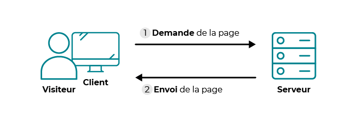

# Documentation PHP

Version: V1
Type: Technique
Date de création: 23 juillet 2023 23:11
Dernière modification: 14 décembre 2023 16:12

## 📣 Introduction

PHP est un langage de programmation utilisé pour développer des sites web dynamiques et interactifs. Il est largement utilisé pour créer des pages web qui peuvent afficher du contenu personnalisé en fonction des données entrées par l'utilisateur. PHP peut être intégré dans le code HTML et permet de traiter les données du formulaire, d'interagir avec des bases de données et de générer des pages dynamiques en temps réel. C'est un langage de programmation gratuit et open-source, largement utilisé sur les sites web du monde entier.




PHP nécessite un serveur web pour être interprété et renvoyer du HTML. En effet, PHP est un langage côté serveur, ce qui signifie que le code PHP est exécuté sur le serveur avant que le navigateur web ne reçoive la page HTML générée. Le serveur web contenant PHP interprète le code PHP et envoie le résultat HTML au navigateur web qui l'affiche à l'utilisateur final. Les serveurs web couramment utilisés pour héberger des sites web en PHP sont Apache, Nginx et Microsoft IIS.

- **Apache** est ce qu'on appelle un serveur web. Il s'agit du plus important de tous les programmes, car c'est lui qui est chargé de délivrer les pages web aux visiteurs. Cependant, Apache ne gère que les sites web statiques (il ne peut traiter que des pages HTML). Il faut donc le compléter avec d'autres programmes.
- **MySQL** est le logiciel de gestion de bases de données le plus populaire. Il permet d'enregistrer des données de manière organisée (comme la liste des membres de votre site).
- **PHP** est un plug-in pour Apache qui le rend capable de traiter des pages web dynamiques en PHP. En clair, en combinant Apache et PHP, notre ordinateur sera capable de lire des pages web en PHP.

## 🗺️ Installation LAMP

**LAMP** : **L**inux **A**pache **M**ySQL **P**HP

🚨 uniquement en cas de problème irremediable

```jsx
sudo apt-get --purge remove php-common # ATTENTION supprime totalement PHP
```

## Sommaire

1. [Installation](https://www.notion.so/PHP-c837841ff0cd4f5d8df380eb1135611f?pvs=21)
2. [Configurer Apache](https://www.notion.so/PHP-c837841ff0cd4f5d8df380eb1135611f?pvs=21)
3. [Configurer PHP](https://www.notion.so/PHP-c837841ff0cd4f5d8df380eb1135611f?pvs=21)

Liens utiles

🔗 [Documentation Apache](https://doc.ubuntu-fr.org/apache2)

🔗 [Documentation MySQL](https://doc.ubuntu-fr.org/mysql)

## 🏗️ Installation

Mise à jours des paquets de votre machine

```bash
sudo apt update # télécharge les mises à jours
sudo apt upgrade # installe les mises à jours
```

Installer Apache2, PHP, MySQL

```bash
sudo apt install apache2 php libapache2-mod-php mysql-server php-mysql
```

- ℹ️ Détails des paquets installé
    - Le paquet `apache2` installe le serveur HTTP [Apache 2](https://doc.ubuntu-fr.org/apache2)
    - Le paquet `php` méta-paquet permettant d'installer au moins un interpréteur [PHP](https://doc.ubuntu-fr.org/php)
    - Le paquet `libapache2-mod-php` installe le module d'Apache pour PHP
    - Le paquet `mysql-server` installe le serveur de bases données [MySQL](https://doc.ubuntu-fr.org/mysql)
    - Le paquet `php-mysql` installe les module permettant d'utiliser MySQL avec PHP

Installer les modules nécessaires à l’utilisation de PHP

```bash
sudo apt install php-curl php-gd php-intl php-json php-mbstring php-xml php-zip
```

Par défaut, Apache et MySQL ou MariaDB démarrent automatiquement lorsque vous allumez votre ordinateur.

Vérifier que les services Apache et MySQL sont actifs sur votre machine, lors de la première installation il peut être nécessaire de redémarrer la machine.

```bash
# voir les services actifs / passif de votre machine
# les actifs sont symbolisés par un +, les passifs pas un -
sudo service --status-all

# désactiver l'allumage automatique
sudo systemctl disable apache2
sudo systemctl disable mysql

# activer l'allumage automatique
sudo systemctl enable apache2
sudo systemctl enable mysql
```

Si l’installation c’est bien déroulé et que Apache est actif vous devriez accéder à une page de documentation Apache en consultant l’URL [http://127.0.0.1/](http://127.0.0.1/)

## 🔬 **Configurer Apache**

Si Apache ne vous a pas créer le dossier `public_html` dans le dossier racine de votre utilisateur créez le.

Activer l’utilisateur du dossier `public_html` comme “dossier utilisateur” avec la commande suivante :

```bash
sudo a2enmod userdir
sudo systemctl restart apache2
```

Créer le fichier `info.php` à la racine du dossier `public_html`, le fichier doit contenir le code suivant :

```bash
<?php phpinfo(); ?>
```

Vous devriez pouvoir accéder au fichier `info.php` depuis l’adresse `localhost/~<votre nom utilisateur>/info.php`, pour moi l’adresse est `[localhost/~kevin/info.php](http://localhost/~kevin/info.php)` car mon nom d’utilisateur machin est “kevin”.

Si vous rencontrez une erreur 403 Forbidden lorsque vous consultez `localhost/~<votre nom utilisateur>/info.php` exécuter la commande suivante

```bash
sudo chmod 711 /home/<votre nom utilisateur>
```

### 🔦 **Configurer Apache pour PHP**

Apache ne permet pas d’interpréter PHP depuis votre dossier `public_html` par défaut, pour cela nous allons devoir éditer un fichier situé dans le dossier `/etc/apache2/mods-enabled`.

Repérer le fichier avec un nom contenant votre version de PHP, ici mon fichier s’appel `php8.0.conf`, et éditez le.

Dans un premier temps activer l’interprétation de PHP dans le dossier `public_html` en commentant le code ci-dessous

```php
# Running PHP scripts in user directories is disabled by default
# 
# To re-enable PHP in user directories comment the following lines
# (from <IfModule ...> to </IfModule>.) Do NOT set it to On as it
# prevents .htaccess files from disabling it.
<IfModule mod_userdir.c>
    <Directory /home/*/public_html>
        php_admin_flag engine Off
    </Directory>
</IfModule>
```

Nous allons ajouter de la configuration pour accéder à l’arborescence de votre dossier `public_html` depuis le navigateur, ajouter le code suivant à la fin du fichier

```php
 <Directory /home/*/public_html/>
        Options Indexes FollowSymLinks
        AllowOverride None
        Require all granted
</Directory>
```

Redémarrer Apache

```bash
sudo systemctl restart apache2
```

Retourner sur l’url `localhost/~<votre nom utilisateur>/info.php`, vous devriez avoir un fichier de configuration de PHP en lieu et place du contenu d’avant, cela signifie que PHP est bien interprété dans votre dossier `public_html`. De plus vous pouvez accéder à l’arborescence du dossier `public_html` depuis l’url `localhost/~<votre nom utilisateur>`

## 🔧 **Configurer PHP**

> ℹ️ Pré-requis pour les instructions suivantes : éditez le fichier `~/public_html/info.php` et remplacez le code avec celui-ci `<?php phpinfo(; ?>`. L’idée est de saboter ce fichier, rendez-vous à l’URL `localhost/~<votre nom utilisateur>/info.php` vous devriez rencontrer une erreur 500, nous allons remédier à ça
> 

Par défaut PHP ne nous indique pas les erreurs d’interprétation, il faut éditer le fichier de configuration de PHP pour l’activer, éditez le fichier `/etc/php/<votre version PHP>/apache2/php.ini`, ici j’utilise la version 8.0 de PHP mon chemin est donc `/etc/php/8.0/apache2/php.ini`. Vous pouvez connaitre l’emplacement de votre fichier de configuration en recherchant “Loaded Configuration File” dans la configuration PHP visible à l’URL `localhost/~<votre nom utilisateur>/info.php`.

⚠️ I**l est conseillez d’utiliser un éditeur de code / bloc note pour les actions suivantes**.

Faite une recherche `CTRL + f` dans votre IDE pour trouver la clé suivante : `error_reporting`, dé-commentez le code suivant en retirant les points virgules `;` en début de ligne et vérifiez que le code contient les bonnes valeurs comme dans le code suivant. 

```php
error_reporting
   Default Value: E_ALL
   Development Value: E_ALL
   Production Value: E_ALL & ~E_DEPRECATED & ~E_STRICT
```

Vous trouverez aussi la clé `error_reporting` à un autre endroit du fichier, assurez vous que le code soit dé-commentez et contienne la valeur suivante.

```php
error_reporting = E_ALL & ~E_DEPRECATED & ~E_STRICT
```

Faite une recherche `CTRL + f` dans votre IDE pour trouver la clé suivante : `display_errors`, dé-commentez le code suivant en retirant les points virgules `;` en début de ligne et assurez-vous que la valeur est à `on`. 

```php
display_errors = On
```

Re-démarrer Apache

```bash
sudo systemctl restart apache2
```

Sauvegardez et quittez le fichier, lorsque vous consultez l’URL `localhost/~<votre nom utilisateur>/info.php` vous devriez avoir un message d’erreur indiquant le problème rencontré au lieu de l’erreur 500. Félicitation PHP est bien configuré pour vous indiquez les erreurs d’interprétation.

Pensez à remettre votre `~/public_html/info.php` en état.

## 🤖 PHP PDO

Assurez-vous d’avoir le module php `pdo_mysql` en exécutant la commande suivante, vous devriez avoir le module `pdo_mysql` dans la liste

```bash
php -m | grep pdo
```