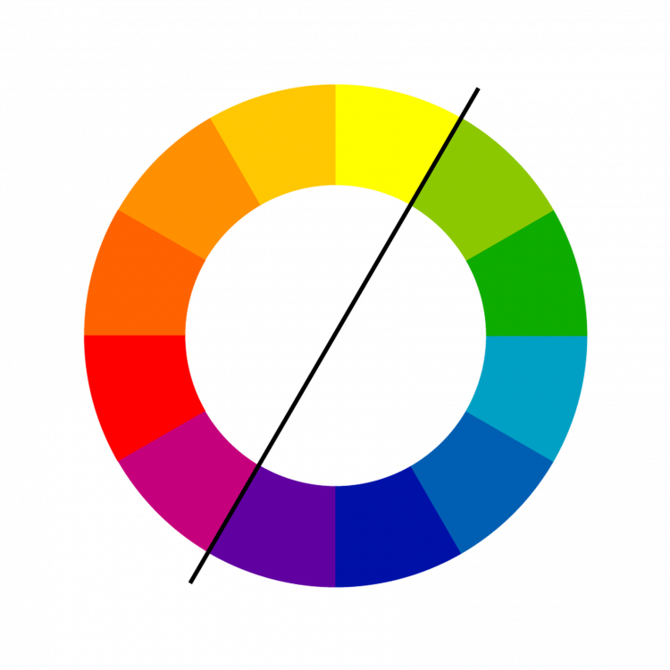
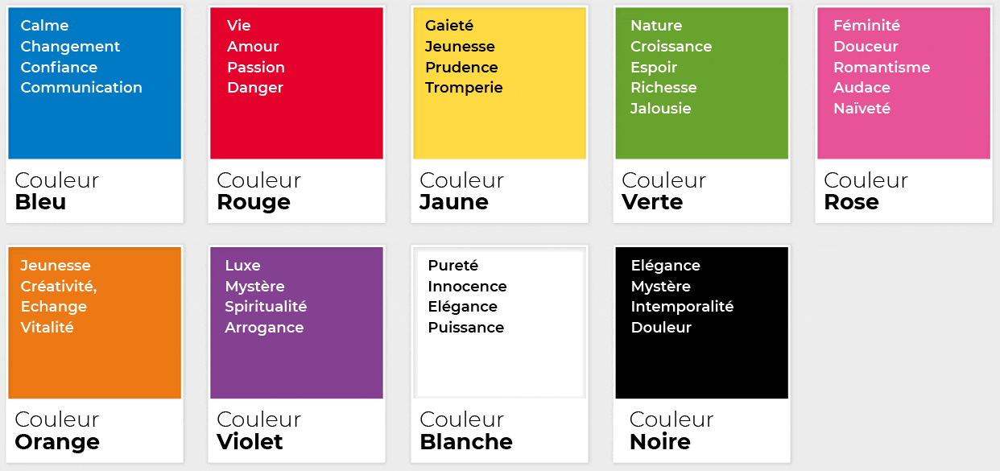
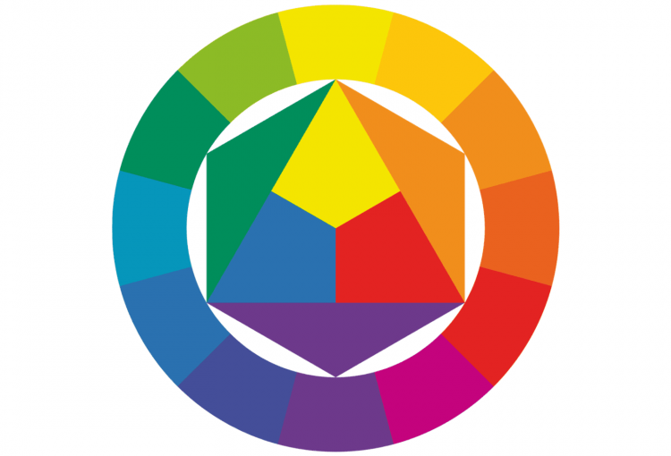
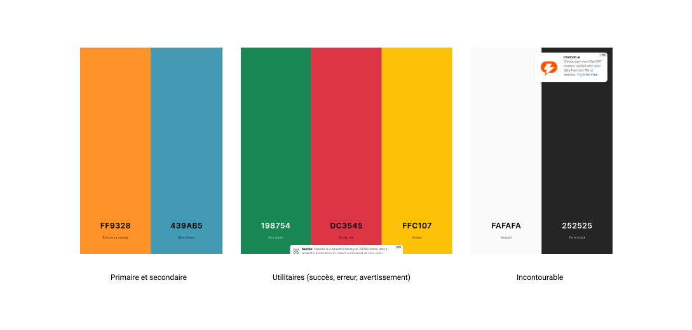
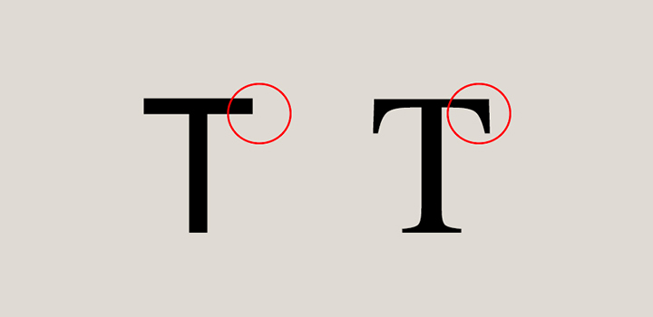
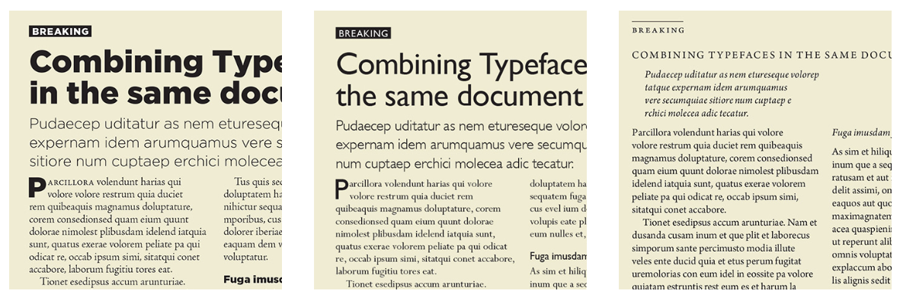
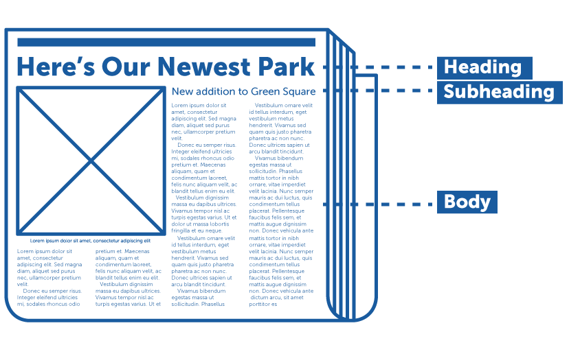
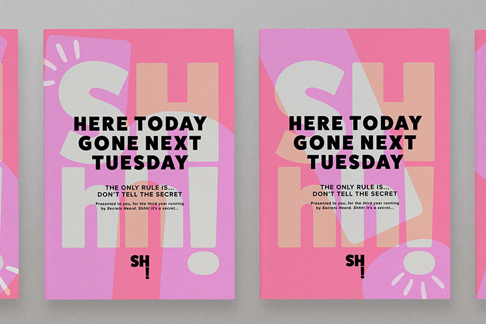

# Le web design

Version: V1
Type: Technique
Date de création: 19 octobre 2023 12:01
Dernière modification: 14 décembre 2023 15:57

## Définition

Il s'agit de l'art de concevoir l'interface utilisateur, la mise en page, les éléments graphiques et les styles pour garantir une expérience utilisateur efficace, esthétique et conviviale sur un site web. 

Le web design prend en compte des aspects tels que la disposition des éléments, la typographie, les couleurs, les images, les icônes, la navigation et la cohérence visuelle. 

Le design web ne se limite pas à l'esthétique, il est étroitement lié à la fonctionnalité et à l'expérience utilisateur. Il joue un rôle essentiel dans la création d'un site web performant qui attire, engage et convertit les visiteurs.

## Importance

- **Communication visuelle :** Les éléments graphiques, les images, les icônes et la disposition aident à transmettre des informations, des émotions et des messages. Une utilisation judicieuse de ces éléments peut renforcer votre image de marque.
- **Expérience utilisateur (UX) :** Le design web influence directement l'expérience utilisateur. Une navigation intuitive, une mise en page bien pensée, des couleurs et une typographie appropriées, ainsi qu'une hiérarchie de l'information claire, améliorent l'ergonomie et la convivialité du site.
- **Accessibilité :** Le design web doit prendre en compte l'accessibilité pour tous. Cela signifie créer des sites qui sont compatibles avec les technologies d'assistance, ce qui élargit encore davantage votre public et peut vous mettre en conformité avec les réglementations en matière d'accessibilité.

## Évolution

Au début du web, les sites étaient souvent complexes avec de nombreuses animations et des éléments visuels chargés. Au fil du temps, il y a eu une tendance croissante vers la simplicité, des designs épurés, des couleurs vives et des interfaces intuitives ont pris le dessus. 

Cette évolution a été en grande partie motivée par la nécessité d'optimiser l'expérience utilisateur et de s'adapter aux écrans mobiles.

# Le choix des couleurs

## Psychologie des couleurs

La psychologie des couleurs influence la manière dont les visiteurs perçoivent et interagissent avec un site. Les concepteurs web doivent comprendre comment les couleurs peuvent être utilisées de manière stratégique.





- **Impact émotionnel :** Les couleurs ont un impact émotionnel et sont influencées par des nuances culturelles, ce qui signifie que le choix des couleurs dans le design web peut évoquer des émotions spécifiques chez les visiteurs et doit être adapté en fonction du public cible.
- **Consistance de la marque :** Les couleurs jouent un rôle essentiel dans la création d'une identité de marque. Il est crucial de choisir des couleurs qui reflètent la personnalité et les valeurs de l'entreprise.
- **Cohérence visuelle :** Utiliser une palette de couleurs bien définie et maintenir une cohérence sur toutes les pages du site créer une expérience utilisateur fluide.
- **Accessibilité :** Il est essentiel de s'assurer que le contraste entre le texte et l'arrière-plan est suffisamment élevé pour garantir que le contenu est lisible pour tous les utilisateurs.

## Cercle chromatique

Pour classer toutes les nuances de couleurs que l’œil humain peut distinguer, il existe un système appelé cercle chromatique qui permet de rassembler les couleurs et d’en faciliter la maîtrise.

Les designers s’appuient sur le cercle chromatique afin de trouver les meilleures combinaisons de couleurs possibles pour créer des palettes harmonieuses et pertinentes.



### Harmonie chromatique

- **Monochrome :** Approche qui repose sur l'utilisation d'une seule couleur de base, mais dans différentes teintes, nuances et tons. Cette méthode crée une palette de couleurs subtile, apaisante et cohérente.
- **Triade :** Consiste à choisir trois couleurs équidistantes les unes des autres sur la roue des couleurs. Cette méthode crée un contraste visuel fort tout en maintenant une certaine cohérence.
- **Complémentaire :** Repose sur l'utilisation de deux couleurs directement opposées sur la roue des couleurs. Cette approche crée un contraste frappant.

## Palette de couleurs

Lors de la conception d'une palette de couleurs pour un site web, il est essentiel de se concentrer sur un nombre limité de couleurs clés pour maintenir la cohérence visuelle et l'efficacité du design. 

Un exemple de ceci se trouve dans les frameworks CSS comme Bootstrap ou PrimeReact, qui propose des couleurs natives essentielles comme :

- **Primaire :** La couleur principale de l’interface .
- **Secondaire :** La couleur secondaire de l’interface.
- **Succès :** Couleur relative aux interactions utilisateurs s’étant correctement déroulé.
- **Danger :** Couleur relative aux interactions utilisateurs ayant échoué.
- **Warning :** Couleur relative aux interactions utilisateurs rencontrant un problème.
- **…**

Et les essentiels :

- **********Blanc**********
- ************Noir************
- ************Gris************



### Liens utiles

🔗 [Créer sa palette de couleur](https://coolors.co/fde8e9-e3bac6-bc9ec1-596475-1f2232)

🔗 [Questionnaire générateur de couleur principale](https://99designs.fr/logo-design/psychology-of-color)

🔗 [Cercle chromatique Adobe Color](https://color.adobe.com/fr/create/color-wheel)

🔗 [Générateur de palette Color Space](https://mycolor.space/)

🔗 [Galerie de palettes de couleurs](https://flatuicolors.com/?source=graphiste-com-blog&utm_source=graphiste-com-blog)

🔗 [Visualiser sa palette de couleur sur une interface web](https://www.realtimecolors.com/?colors=130e01-fffaeb-ff8400-fff5d6-cf4307&fonts=Supermercado%20One-Supermercado%20One)

# Le choix des polices

Le choix des polices (typographie) est un élément important du design web, car il affecte la lisibilité et la hiérarchie de l'information.

### **Lisibilité**

Facteur primordial lors du choix de polices pour un site web. Les polices doivent être faciles à lire, quel que soit le support utilisé, la taille de l'écran ou les conditions d'éclairage. 

### **Hiérarchie de l'information**

La typographie est un outil essentiel pour établir une hiérarchie de l'information. Cela signifie que les polices peuvent être utilisées pour différencier visuellement les titres, les sous-titres, le texte du corps et d'autres éléments de contenu.

Les variations de taille, de graisse (bold), d'espacement entre les lettres et de couleur de police peuvent tous être utilisées pour indiquer l'importance relative du texte.

### **Concordance avec la marque**

Les polices choisies doivent refléter l'identité de la marque. Une entreprise sérieuse et établie peut opter pour des polices classiques et traditionnelles, tandis qu'une start-up axée sur la technologie peut préférer des polices modernes et audacieuses.

## Sérif ou Sans Sérif ?



### Police Sans Sérif

Les polices Sans Serif (sans empattement) sont caractérisées par leur simplicité et leur lisibilité. Contrairement aux polices Sérif, elles ne possèdent pas les petites extensions à l'extrémité des caractères. Les polices Sans Serif sont souvent associées à la modernité, à la clarté et à la simplicité.

Ces polices sont fréquemment utilisées dans le design web. Elles sont souvent préférées pour les interfaces utilisateur, les légendes, les graphiques et d'autres éléments de design web. Les polices sans empattement, comme **Arial**, sont populaires en raison de leur simplicité, leur lisibilité.

### Police Sérif

Les polices Sérif (à empattements) sont d’origine inconnue, une théorie suggère que les empattements proviendraient de la trace laissée par l’outil (plume, pinceau, etc.) lorsque la main s’élève en achevant le geste d’écriture.

Les polices Sérif peuvent exprimer l’autorité, le professionnalisme, ou suggérer le poids de l’histoire et de l’expérience. Une police de caractères Sérif, comme **Times New Roman**, évoque certains grands journaux, tel que *The New York Times*, et d’autres institutions réputées

Elles ont aussi un rôle fonctionnel pour le lecteur, une police Sérif améliore la lisibilité des petits caractères. Lorsque vous lisez une petite police d’écriture, les empattements vous aident à mieux distinguer les formes des lettres et facilitent la lecture.



## Hiérarchie des éléments

Une hiérarchie des textes permet de distinguer visuellement les différents niveaux d'importance du contenu d'une page web. Elle indique aux visiteurs quels éléments sont les plus importants et les guident dans leur lecture.



### **Les Tailles de Texte**

En règle générale, la taille de police pour le texte principal (paragraphe) sur de nombreux sites web oscille généralement entre 16 et 18 pixels. Cependant, il est crucial de noter que la taille de police peut varier en fonction du style et de la conception spécifiques du site, ainsi que des préférences du designer.

Il existe plusieurs unités de mesure couramment utilisées pour spécifier la taille de police en CSS. Voici quelques-unes des plus courantes :

- **Pixels (px)** : Les pixels offrent un contrôle précis sur la taille de police, mais ils ne sont pas adaptatifs aux préférences de taille de police de l'utilisateur.
- **Em (em)** : L'unité "em" est relative à la taille de police de l'élément parent. Par exemple, si la taille de police de l'élément parent est de 16 pixels, 1 em équivaut à 16 pixels. Les "em" sont souvent utilisés pour créer une hiérarchie de tailles de police relatives à l'élément parent.
- **Rem (root em)** : Les "rem" sont relatifs à la taille de police de l'élément racine, généralement l'élément **`<html>`**. Les "rem" sont couramment utilisés pour établir une hiérarchie de tailles de police en fonction de la taille de police de base de l'élément racine, ce qui facilite l'ajustement global des tailles de police en cas de besoin.

L’unité de mesure **rem** permettent une approche plus adaptative. En définissant la taille de police en fonction de l'élément racine, toute modification de la taille de police de base affectera uniformément l'ensemble des tailles de police, simplifiant ainsi les ajustements globaux.

Sur une taille de police de base de 16 pixels on obtiendrait les tailles de police suivante

```scss
// Font size.
$font_size_h1: 2.5rem; // 40 pixels
$font_size_h2: 2rem; // 32 pixels
$font_size_h3: 1.5rem; // 24 pixels
$font_size_h4: 1.25rem; // 20 pixels
$font_size_p: 1rem; // 16 pixels
```

Pour améliorer la hiérarchie de vos typographies, il y a des éléments sur lesquels vous pouvez agir :

- La graisse de la police (Font weight).
- La hauteur de ligne (Line height).
- La couleur du texte
- L’espacement

```scss
// Font weight.
$regular: 400;
$medium: 500;
$semi_bold: 600;
$bold: 700;
$extra_bold: 800;

// Line height.
$line_height_h1: 48px;
$line_height_h2: 38px;
$line_height_h3: 29px;
$line_height_h4: 24px;
$line_height_p: 24px;
```



### Liens utiles

🔗 [Polices gratuites Google Font](https://fonts.google.com/)

🔗 [Font flippe](https://fontflipper.com/upload)r

🔗 [Les 30 meilleures combinaisons de police pour le web design](https://elementor.com/blog/font-pairing/)

🔗 [Combinaisons de police](https://99designs.com/blog/tips/font-pairings/)

# Composition et mise en page

La composition et la mise en page sont des éléments fondamentaux du web design. Ils influencent la manière dont les utilisateurs perçoivent et interagissent avec un site web. Voici quelques principes de base à prendre en compte lors de la conception de la mise en page d'un site web :

1. **Équilibre** : L'équilibre dans la mise en page est essentiel. Il peut être symétrique, où le contenu est réparti de manière égale de part et d'autre d'un axe central, ou asymétrique, où les éléments sont répartis de manière équilibrée mais pas symétrique. L'équilibre contribue à une apparence visuellement agréable.
2. **Contraste** : Le contraste permet de mettre en évidence certains éléments par rapport à d'autres. Vous pouvez utiliser le contraste de couleur, de taille, de police, etc., pour attirer l'attention sur des éléments clés, comme les titres, les appels à l'action ou les informations importantes.
3. **Proximité** : Les éléments qui sont visuellement proches les uns des autres sont généralement perçus comme liés. Vous pouvez regrouper des éléments pour créer une hiérarchie visuelle et guider les utilisateurs à travers le contenu.
4. **Alignement** : L'alignement assure une cohérence visuelle. Les éléments alignés sur une grille donnent une apparence plus propre et organisée à votre site. Cela facilite également la lecture et la compréhension.
5. **Représentation visuelle** : Utilisez des éléments visuels, tels que des icônes, des images et des formes, pour compléter le contenu éditorial. Ces éléments visuels aident à transmettre des informations de manière plus engageante.

La hiérarchie des éléments de l'interface utilisateur revêt une importance cruciale. La hiérarchisation visuelle vise à guider les utilisateurs à travers le contenu de votre site web en mettant en évidence ce qui est le plus important et en organisant de manière logique les éléments. Plusieurs éléments contribuent à la création d'une hiérarchie visuelle efficace, notamment la taille et le poids de la police, les couleurs, les espacements, entre autres.

## Design responsif

Le design responsif est un pilier du design web moderne, car il assure l'adaptabilité des sites web à tous appareils et tailles d'écran, garantissant ainsi une expérience utilisateur optimale, indépendamment de l'appareil utilisé pour consulter le site.

Il est préférable de commencer par la conception mobile, cela oblige à hiérarchiser les éléments et de réduire le contenu superflu. Cette approche rend plus facile l'adaptation du design aux écrans de bureau plus grands, car vous pouvez ajouter des éléments supplémentaires sans surcharger la version bureau.

Les grilles CSS permettent de créer des mises en page flexibles et réactives, tandis que les media queries permettent d'appliquer des styles CSS spécifiques en fonction de la résolution de l'écran. 

### Liens utiles

🔗 [Principes de base de la mise en page de site web](https://99designs.fr/blog/conseils-design/principes-base-de-mise-en-page-de-site-web/)

🔗 [Librairie d’inspiration pour composant UI](https://calltoinspiration.com/)